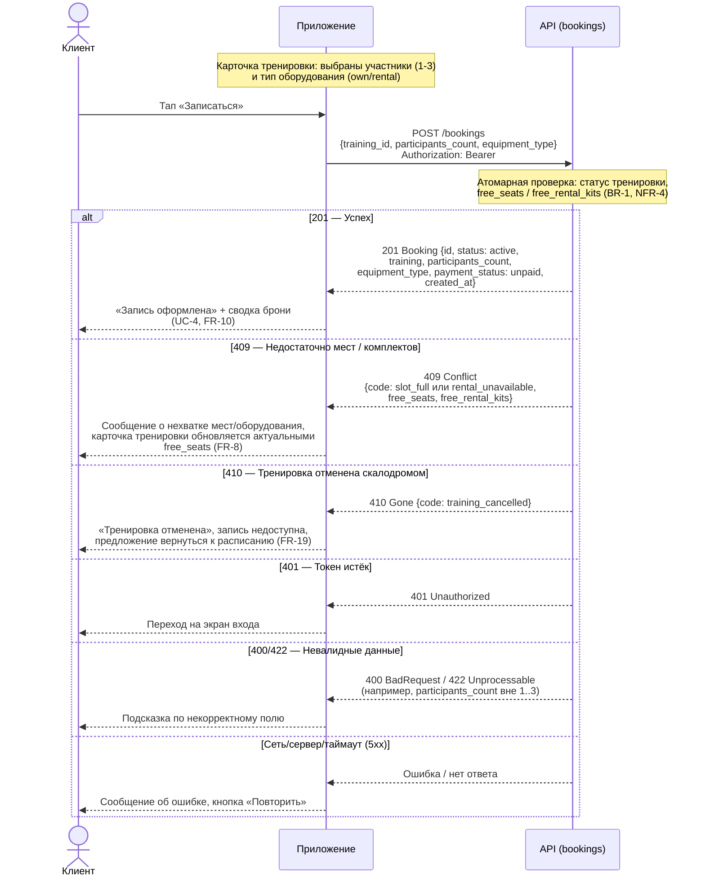

# Sequence-диаграмма API-взаимодействия: запись на тренировку

> Этап 3. Проектирование. Взаимодействие клиентского приложения и API в сценарии
> «Запись на тренировку» (`createBooking`, UC-4). Сопутствующий документ — [data-model.md](data-model.md).
>
> Основано на: business-requirements.md (BR), functional-requirements.md (FR),
> non-functional-requirements.md (NFR), use-cases.md (UC-4), user-stories.md (US-4–US-6).

## Сквозные правила взаимодействия

- Все вызовы — с `Authorization: Bearer <token>`. При истёкшем/неверном токене сервер отвечает
  `401`, клиент направляется на экран входа.
- Backend — **единственный источник истины** по свободным местам, статусу тренировки и
  доступности прокатного комплекта; клиент их не пересчитывает (NFR-6, техническое ограничение
  «проверка свободных мест выполняется сервером»).
- Проверка мест и создание брони выполняются **атомарно**: параллельная запись нескольких
  клиентов на один слот не должна приводить к превышению вместимости (BR-1, NFR-3, NFR-4).
- Итоговая цена не пересчитывается онлайн (оплата офлайн, BR-13); приложение показывает
  `training.price × participants_count` как справочную сумму к оплате на месте.

## Сценарий: создание брони (`createBooking`, UC-4)

Клиент выбирает тренировку, тип оборудования (`own`/`rental`) и число участников
(`participants_count`, 1–3), после чего подтверждает запись.

## Разбор ключевых веток

| Код | Условие | Тело ответа | Реакция приложения | Требования |
|---|---|---|---|---|
| **201** | Тренировка `scheduled`, `free_seats ≥ participants_count`, при `equipment_type = rental` — `free_rental_kits ≥ 1` | `Booking` со `status = active` | Показывает подтверждение и сводку брони; бронь появляется в разделе «Мои бронирования» | BR-2, FR-5, FR-10, UC-4 |
| **409** | Гонка/недостаток мест: на момент атомарной проверки `free_seats < participants_count` (в т.ч. если место заняла параллельная бронь) либо не хватает прокатных комплектов | `Error {code, free_seats, free_rental_kits}` | Не создаёт бронь; обновляет отображаемую доступность тренировки без дополнительного запроса, опираясь на тело ошибки | BR-1, FR-8, FR-9, NFR-4 |
| **410** | Тренировка уже переведена backend в `status = cancelled` (отменена скалодромом) до того, как клиент успел записаться | `Error {code: training_cancelled}` | Блокирует повторную/новую запись на эту тренировку, направляет клиента к актуальному расписанию | FR-17–FR-19 |

## Почему именно так

- **409 вместо тихого отказа** — клиенту явно возвращаются актуальные `free_seats`/
  `free_rental_kits`, чтобы приложение не делало отдельный повторный запрос на чтение слота
  (снижает число round-trip'ов, релевантно NFR-2 — операция бронирования ≤ 3 секунд).
- **410, а не 409, для отменённой тренировки** — семантически это не «конфликт по вместимости», а
  «ресурс более недоступен» (тренировка снята с расписания), что прямо соответствует FR-19
  («запретить повторную запись на отменённую тренировку»).
- **Атомарность проверки и списания мест на стороне backend** — единственный способ выполнить
  BR-1 («исключить двойные бронирования») и NFR-4 при одновременной записи нескольких клиентов
  на один слот (NFR-3).

## Связь с другими сущностями

Полная модель состояний брони (`active → cancelled / late_cancel / club_cancelled`) и связанные
инварианты свободных мест — в [data-model.md → «Модель состояний»](data-model.md#модель-состояний-жизненный-цикл).
Сценарий отмены брони (`cancelBooking`) и push-уведомление об отмене тренировки скалодромом
(UC-7) в текущий документ не входят и могут быть описаны отдельным сценарием при необходимости.
