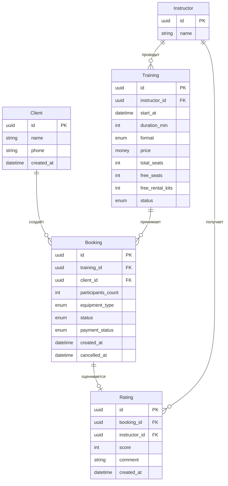
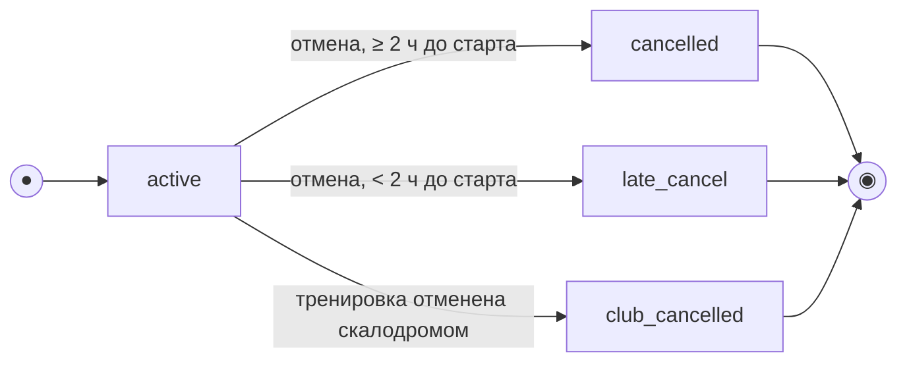
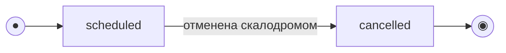

# Модель данных

> Этап 3. Проектирование. Сущности, атрибуты, связи и ERD клиентского мобильного приложения
> скалодрома «Вертикаль».
>
> **Скоуп: клиентское приложение и его API.** Это **ресурсная модель API** (что клиент
> читает и что создаёт/изменяет через API), а не схема БД существующего backend — хранение
> расписания, инструкторов и прокатного фонда остаётся зоной ответственности существующей
> административной системы (BR-11, технические ограничения domain-description.md).
>
> Документ построен на основании: business-requirements.md (BR), functional-requirements.md
> (FR), non-functional-requirements.md (NFR), use-cases.md (UC), user-stories.md (US),
> domain-description.md.

---

## Легенда: кто владеет данными

| Пометка | Значение |
|---|---|
| 🔒 **Read-only** | Сущность приходит из существующего backend через API; клиентское приложение только отображает её и не создаёт/не изменяет (NFR-14, технические ограничения) |
| ✏️ **Mutable (клиентский API)** | Сущность создаётся и/или изменяется через API, обслуживающее клиентское приложение, в рамках текущей поставки |

---

## Сущности и атрибуты

### 🔒 Instructor (Инструктор) — read-only справочник

Отображается только как справочная информация (domain-description.md → «Инструктор»); управление
инструкторами — вне скоупа (BR, границы проекта).

| Атрибут | Тип | Описание |
|---|---|---|
| id | UUID (PK) | Идентификатор инструктора |
| name | string | Имя инструктора |

---

### 🔒 Training (Тренировка / слот) — read-only для клиента

Создаётся и изменяется существующей административной системой (BR-11, NFR-14). Клиентское
приложение получает данные только на чтение и не пересчитывает свободные места самостоятельно
(NFR-6, техническое ограничение «проверка свободных мест выполняется сервером»).

| Атрибут | Тип | Описание | Источник |
|---|---|---|---|
| id | UUID (PK) | Идентификатор тренировки | — |
| start_at | datetime | Дата и время начала | FR-2 |
| duration_min | int | Продолжительность (≈90 мин, домен: «около 1,5 часов») | domain-description.md → Бизнес |
| format | enum (`novice` / `experienced`) | Формат: для новичков / для опытных | FR-2, domain-description.md → Формат тренировки |
| instructor_id | FK → Instructor | Назначенный инструктор | FR-2 |
| price | money | Стоимость за место | FR-2 |
| total_seats | int | Общее число мест (novice ≤ 8, experienced ≤ 16) | Бизнес-ограничения BR |
| free_seats | int | Свободных мест (расчёт на стороне backend) | FR-2, FR-8 |
| free_rental_kits | int? | Доступность прокатного комплекта оборудования (расчёт backend). *Числовой лимит прокатного фонда явно не зафиксирован в требованиях — открытый вопрос к продукт-владельцу* | FR-9 |
| status | enum (`scheduled` / `cancelled`) | Статус тренировки; переход в `cancelled` инициируется скалодромом (не клиентом) | FR-17–FR-19, domain-description.md |

> Формат определяет допустимую вместимость: `total_seats` тренировки для новичков ≤ 8,
> тренировки для опытных ≤ 16 (бизнес-ограничения business-requirements.md).

---

### ✏️ Client (Клиент) — mutable, регистрируется через клиентский API

| Атрибут | Тип | Описание |
|---|---|---|
| id | UUID (PK) | Идентификатор клиента |
| name | string | Имя |
| phone | string (unique) | Телефон клиента |
| created_at | datetime | Дата регистрации |

> Механизм подтверждения регистрации (например, код из SMS) в предоставленных требованиях не
> детализирован — это открытый вопрос вне текущего пакета документов; регистрация клиента
> входит в скоуп (границы проекта business-requirements.md), но её протокол требует уточнения
> на этапе API-дизайна.

---

### ✏️ Booking (Бронь) — mutable, создаётся/отменяется через клиентский API

Ключевая изменяемая сущность приложения (BR-2, FR-5).

| Атрибут | Тип | Описание | Источник |
|---|---|---|---|
| id | UUID (PK) | Идентификатор брони | — |
| training_id | FK → Training | Тренировка, на которую оформлена бронь | FR-5 |
| client_id | FK → Client | Кто оформил бронь | — |
| participants_count | int (1–3) | Число участников: сам клиент + до двух гостей | BR-7, FR-7 |
| equipment_type | enum (`own` / `rental`) | Собственное оборудование либо полный прокатный комплект скалодрома **на бронь целиком** (domain-description.md → Снаряжение: «полный комплект») | BR-6, FR-6, FR-9 |
| status | enum (`active` / `cancelled` / `late_cancel` / `club_cancelled`) | Статус брони, см. модель состояний ниже | FR-10, FR-13–FR-19 |
| payment_status | enum (`unpaid` / `paid`), read-only для клиента | Статус офлайн-оплаты; фиксируется персоналом скалодрома, приложение только отображает (BR-13 — без онлайн-оплаты) | FR-12 |
| created_at | datetime | Время создания брони | — |
| cancelled_at | datetime? | Время отмены, если была | FR-13 |

> Стоимость брони не хранится отдельным полем: клиент оформляет запись по цене `training.price`
> за участника; расчёт итоговой суммы к оплате (наличными/переводом) остаётся зоной
> ответственности офлайн-процесса оплаты (BR-13) и не формализован явным требованием — это
> предположение зафиксировано как допущение, а не решение продукта.

---

### ✏️ Rating (Оценка инструктора) — mutable, создаётся клиентом после тренировки

В отличие от многих аналогичных проектов, оценки инструкторов **входят в скоуп** текущей
поставки (BR-10, Should) — это отдельная изменяемая сущность клиентского API.

| Атрибут | Тип | Описание | Источник |
|---|---|---|---|
| id | UUID (PK) | Идентификатор оценки | — |
| booking_id | FK → Booking | Бронь, в рамках которой клиент посетил тренировку | FR-20–FR-22 |
| instructor_id | FK → Instructor | Денормализовано для удобства чтения (совпадает с `training.instructor_id`) | — |
| score | int (1–5) | Оценка по пятибалльной шкале | FR-20 |
| comment | string? | Необязательный текстовый отзыв | FR-21 |
| created_at | datetime | Время выставления оценки | — |

> Оставить оценку можно только после завершённой тренировки — ограничение проверяется backend
> при создании `Rating` (FR-22): `training.start_at + duration_min` должно быть в прошлом
> относительно текущего момента, а `booking.status` — быть `active` (клиент фактически
> записывался и не отменил участие).

---

## ERD

---

## Модель состояний (жизненный цикл)

### Booking

`status ∈ {active, cancelled, late_cancel, club_cancelled}`. Создаётся в `active`; любой переход
из `active` — терминальный (повторная отмена не выполняется). Тип отмены (ранняя/поздняя)
определяет **сервер** по времени до старта тренировки, а не клиент (согласуется с NFR-6:
единственный источник актуальных данных — backend).

| Из | Событие / условие | В | Эффект на тренировку | Требования |
|---|---|---|---|---|
| — | Клиент подтверждает запись | `active` | `free_seats -= participants_count`; при `equipment_type = rental` — `free_rental_kits -= 1` | BR-2, FR-5, FR-8 |
| `active` | Отмена, до старта ≥ 2 ч | `cancelled` | Места и прокатный комплект **возвращаются** | FR-14 |
| `active` | Отмена, до старта < 2 ч | `late_cancel` | Место и прокатный комплект **не возвращаются**; денежного штрафа нет | FR-15, FR-16 |
| `active` | Тренировка отменена скалодромом (`Training.status → cancelled`) | `club_cancelled` | Клиент получает push-уведомление; повторная запись на эту тренировку запрещена | BR-8, FR-17–FR-19 |
| `cancelled` / `late_cancel` / `club_cancelled` | — (терминальные) | — | Повторная отмена невозможна | — |

> Отмена доступна только пока тренировка не началась (UC-6). Оценка инструктора возможна только
> из состояния `active`/после завершения тренировки по времени (FR-22).

### Training

`status ∈ {scheduled, cancelled}` — read-only для клиента; переход инициирует существующая
инфраструктура (владелец скалодрома), а не клиентское приложение (NFR-14).

| Статус | Что видит клиент | Запись доступна |
|---|---|---|
| `scheduled`, старт в будущем | Тренировка в расписании, при `free_seats = 0` — «мест нет» | Да, если `free_seats > 0` |
| `scheduled`, старт в прошлом *(производится вычислением, отдельного статуса нет)* | Отображается как прошедшая (для истории броней и открытия оценки) | Нет |
| `cancelled` | «Тренировка отменена» | Нет (в т.ч. для клиентов с уже существующей `active` бронью — она переводится в `club_cancelled`) |

---

## Ключевые инварианты (целостность данных)

- `Training.free_seats = Training.total_seats − Σ(participants_count по броням в статусах active + late_cancel)` — при поздней отмене место не возвращается в фонд (FR-15).
- `Training.total_seats ≤ 8` для формата `novice` и `≤ 16` для формата `experienced` (бизнес-ограничения BR).
- `Booking.participants_count ∈ [1, 3]` — один клиент бронирует не более трёх участников (BR-7, FR-7).
- Создание брони запрещено, если `Training.free_seats < participants_count` или `Training.status = cancelled` (FR-8, FR-19).
- Запись и отмена выполняются **атомарно** на стороне backend: параллельные запросы не должны приводить к превышению `total_seats` (двойное бронирование исключено) — BR-1, NFR-3, NFR-4.
- `Rating` может быть создан только для `Booking.status = active`, когда `Training.start_at + duration_min` уже в прошлом (FR-22); не более одной оценки на бронь.
- `Booking.payment_status` изменяется только офлайн-процессом (персоналом), клиентское приложение это поле не редактирует (BR-13).

---

## Сущности вне скоупа клиентского API

Следующее относится к существующей инфраструктуре и не моделируется в клиентском API
(business-requirements.md → границы проекта, functional-requirements.md → ограничения
функциональности):

- управление расписанием и создание тренировок;
- управление инструкторами;
- прокатный фонд оборудования как отдельная управляемая сущность (клиент получает только
  агрегат `free_rental_kits`);
- онлайн-платежи и связанные с ними сущности;
- административные роли и интерфейсы.
