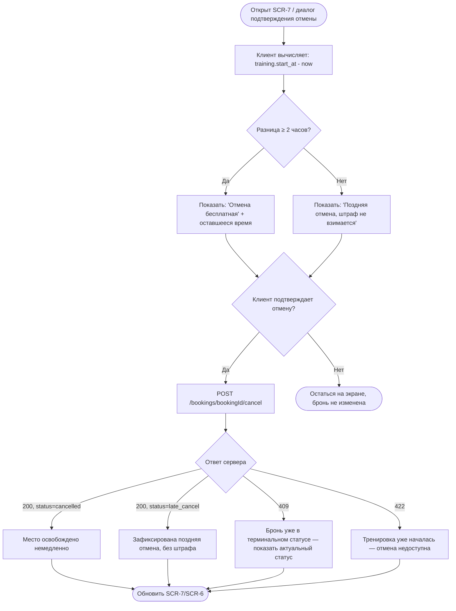

# Логика политики отмены бронирования (правило 2 часов)

**ID:** LOGIC-002
**Тип:** Логика
**Домен:** 09. Логики
**Приоритет:** Critical
**Статус:** На согласовании
**Функциональные блоки:** FB-CANCEL-POLICY

---

## История изменений

| Релиз | ТЗ | Описание изменений |
|-------|-----|-------------------|
| 0.1.0 | 03-training-details.md, 04-booking-form.md, 07-booking-details-cancel.md | Первоначальная документация |

---

## Входные данные

| Название | Тип | Возможные значения | Описание |
|----------|-----|-------------------|----------|
| `training.start_at` | Состояние (из API) | ISO date-time | Время начала тренировки |
| Текущее время устройства | Состояние | ISO date-time | Используется только для **предварительного** информирования клиента; окончательное решение о типе отмены принимает сервер |

---

## Обзор

Клиент может бесплатно отменить бронь не позднее чем за 2 часа до начала
тренировки. Отмена позже этого порога фиксируется как «поздняя отмена», но
денежный штраф не начисляется (FR-16). Клиентское приложение обязано **заранее
и наглядно** показать пользователю, какой тип отмены произойдёт, чтобы решение
было осознанным — однако окончательную классификацию (`cancelled` vs
`late_cancel`) в ответе на `POST /bookings/{bookingId}/cancel` определяет
backend по серверному времени (источник истины — сервер, NFR-6), а не
локальные часы устройства.

### User Story

> Как клиент, я хочу заранее видеть, будет ли моя отмена бесплатной или
> поздней, чтобы принять взвешенное решение об отмене брони.

### Бизнес-ценность

- Прозрачность условий отмены повышает долю самостоятельных (а не через
  поддержку) отмен — метрика M-3 из бизнес-требований.
- Явное отсутствие штрафа при поздней отмене (FR-16) снижает тревожность
  пользователя перед действием.

---

## Точки применения

| Экран/Компонент | Элемент/Триггер | Условие |
|-----------------|-----------------|---------|
| [SCR-3 Карточка тренировки](../screens/SCR-3_training-details.md) | Информационный блок «Политика отмены» | Всегда, как справочная информация до записи |
| [SCR-7 Детали бронирования](../screens/SCR-7_booking-details-cancel.md) | Индикатор "осталось времени до тренировки" + диалог подтверждения отмены | При открытии экрана и при нажатии «Отменить бронирование» |

---

## Флоу

---

## Описание логики

### Шаг 1: Локальный предварительный расчёт (для UI)

`remaining = training.start_at − now`. Если `remaining ≥ 2 часа` — экран
показывает пометку «Бесплатная отмена» и обратный отсчёт/оставшееся время до
границы. Если `remaining < 2 часа` (включая случай, когда тренировка уже
началась) — экран показывает пометку «Поздняя отмена — без штрафа».
Этот расчёт носит **информационный** характер (расхождение часов устройства с
сервером возможно) — финальный тип отмены и её допустимость определяет backend.

### Шаг 2: Подтверждение действия

Перед отправкой запроса на отмену показывается диалог с явным указанием типа
отмены (бесплатная/поздняя), рассчитанного на Шаге 1, — снижает риск случайной
отмены и делает решение осознанным.

### Шаг 3: Отправка запроса и обработка серверного решения

`POST /bookings/{bookingId}/cancel` — сервер сравнивает своё время с
`training.start_at` и возвращает бронь с итоговым статусом (`cancelled` либо
`late_cancel`, см. `BookingStatus`). Именно это значение, а не локальный
расчёт из Шага 1, отображается после успешного ответа, через
[LOGIC-001](./LOGIC-001_status-broni.md).

### Шаг 4: Граничные и ошибочные случаи

- `422` — тренировка уже началась, кнопка отмены должна была быть уже
  неактивна на UI; если запрос всё же ушёл (race condition) — показать снек
  с сообщением сервера и обновить экран.
- `409` — бронь уже в терминальном статусе (например, отменена в другой
  сессии/на другом устройстве) — обновить экран, показав актуальный статус.

---

## API запросы

### POST /bookings/{bookingId}/cancel

**Триггер:** Подтверждение отмены в диалоге на SCR-7

**Headers:**

| Поле | Описание |
|------|----------|
| `Authorization` | `Bearer {токен клиента}` |

**Параметры/Body:** без тела запроса, `bookingId` — часть пути.

**Обработка ответа:**

| Результат | Действие |
|-----------|----------|
| Загрузка | Лоадер на кнопке подтверждения, не более 3 секунд (NFR-2) |
| Успех 200 (`status=cancelled`) | Обновить бейдж на «Отменена клиентом», место освобождено (FR-14) |
| Успех 200 (`status=late_cancel`) | Обновить бейдж на «Поздняя отмена», пояснение «штраф не взимается» (FR-16) |
| Ошибка 403 | Снек "Нет доступа к этой брони" (не должно происходить в норме, NFR-9) |
| Ошибка 409 | Снек с текстом из `message`, обновить статус брони на экране |
| Ошибка 422 | Снек с текстом из `message` ("Тренировка уже началась"), скрыть кнопку отмены |
| Ошибка 5xx | Снек "Произошла ошибка. Попробуйте позже" |
| Ошибка сети | Снек "Нет соединения. Проверьте подключение к интернету" |

---

## Связанные требования

### Функциональные

| ID | Название | Приоритет |
|----|----------|-----------|
| FR-13 | Возможность отмены брони клиентом | Critical |
| FR-14 | Освобождение места при ранней отмене | Critical |
| FR-15 | Фиксация поздней отмены | Critical |
| FR-16 | Отсутствие денежного штрафа за позднюю отмену | Critical |

### Данные

| ID | Название | Приоритет |
|----|----------|-----------|
| NFR-2 | Отклик операции отмены не более 3 секунд | High |
| NFR-5 | Немедленное освобождение места при ранней отмене | High |
| NFR-6 | Backend — единственный источник истины по времени/статусу | Critical |

---

## Критерии приёмки

| ID | Критерий |
|----|----------|
| AC-001 | **Дано** до тренировки ≥ 2 часов, **Когда** клиент открывает диалог отмены, **Тогда** показывается пометка «Бесплатная отмена» |
| AC-002 | **Дано** до тренировки < 2 часов, **Когда** клиент открывает диалог отмены, **Тогда** показывается пометка «Поздняя отмена — без штрафа» |
| AC-003 | **Дано** подтверждена ранняя отмена, **Когда** сервер возвращает `status=cancelled`, **Тогда** место немедленно освобождается и статус брони обновляется |
| AC-004 | **Дано** подтверждена поздняя отмена, **Когда** сервер возвращает `status=late_cancel`, **Тогда** отображается статус без указания какого-либо штрафа |
| AC-005 | **Дано** тренировка уже началась, **Когда** клиент пытается отменить бронь, **Тогда** кнопка отмены неактивна/скрыта ещё до отправки запроса |
| AC-006 | **Дано** ответ сервера 422, **Когда** запрос всё же был отправлен (race condition), **Тогда** пользователь видит понятное сообщение и экран обновляется |

---

## Обработка ошибок

| Тип ошибки | Контекст | Действие |
|------------|----------|----------|
| Рассинхронизация часов устройства и сервера | Локальный расчёт на Шаге 1 не совпал с решением сервера | Всегда доверять ответу сервера как финальному источнику; локальный расчёт — только предварительная подсказка |
| Повторная отмена уже отменённой брони | 409 от сервера | Показать снек и обновить статус, кнопку отмены скрыть |

---
