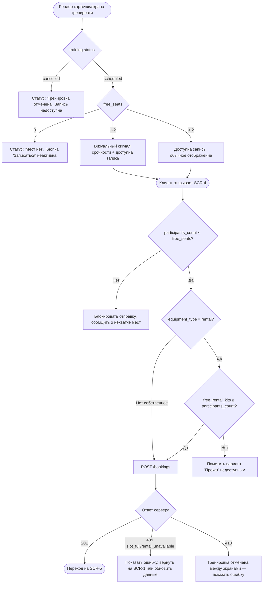

# Логика доступности записи на тренировку

**ID:** LOGIC-004
**Тип:** Логика
**Домен:** 09. Логики
**Приоритет:** Critical
**Статус:** На согласовании
**Функциональные блоки:** FB-BOOKING-AVAILABILITY

---

## История изменений

| Релиз | ТЗ | Описание изменений |
|-------|-----|-------------------|
| 0.1.0 | 01-schedule-list.md, 03-training-details.md, 04-booking-form.md | Первоначальная документация |
| 0.1.1 | Решение по открытому вопросу №5 (см. `00-OPEN-QUESTIONS-LOG.md`) | Порог «мало мест» закреплён как `≤ 2`, вынесен в Remote Config вместо хардкода — изменяется без релиза приложения |

---

## Входные данные

| Название | Тип | Возможные значения | Описание |
|----------|-----|-------------------|----------|
| `training.status` | Состояние (из API) | `scheduled`, `cancelled` | Статус тренировки |
| `training.free_seats` | Состояние (из API) | `0..total_seats` | Количество свободных мест |
| `training.free_rental_kits` | Состояние (из API) | целое число, nullable | Доступность прокатных комплектов |
| `low_seats_threshold` | Remote Config | целое число, дефолт `2` | Порог «мало мест» для визуального сигнала срочности (см. Шаг 2) — изменяется продуктом без релиза приложения |

---

## Обзор

Единая логика, определяющая, доступна ли тренировка для записи, и какой
визуальный статус показывать в списке (SCR-1) и на карточке (SCR-3). Финальную
проверку мест/статуса всегда выполняет backend атомарно в момент создания
брони (`POST /bookings`, см. `openapi.yaml`, NFR-3, NFR-4) — клиентская
логика ниже описывает только **отображение** и **раннюю блокировку UI**, не
заменяющую серверную проверку.

### User Story

> Как клиент, я хочу сразу видеть в списке и на карточке тренировки, могу ли
> я на неё записаться, чтобы не тратить время на попытку записи туда, где
> мест уже нет.

### Бизнес-ценность

- Прозрачная индикация мест снижает число неуспешных попыток записи.
- Визуальное выделение тренировок с малым числом мест стимулирует быстрое
  принятие решения (сигнал срочности).
- Двойные бронирования исключены на уровне сервера в любом случае (NFR-4).

---

## Точки применения

| Экран/Компонент | Элемент/Триггер | Условие |
|-----------------|-----------------|---------|
| [SCR-1 Список тренировок](../screens/SCR-1_schedule-list.md) | Карточка тренировки в списке | Для каждой карточки при рендере |
| [SCR-3 Карточка тренировки](../screens/SCR-3_training-details.md) | Кнопка «Записаться» | При открытии экрана |
| [SCR-4 Оформление записи](../screens/SCR-4_booking-form.md) | Валидация перед отправкой формы | При изменении количества участников/оборудования и при сабмите |

---

## Флоу

---

## Описание логики

### Шаг 1: Определение статуса тренировки

`training.status = cancelled` — тренировка полностью недоступна для записи на
любом экране, независимо от количества мест (FR-19). Отображается статус
«Тренировка отменена».

### Шаг 2: Определение доступности по местам

Для `training.status = scheduled`:
- `free_seats = 0` → статус «Мест нет», запись недоступна (FR-8).
- `free_seats ≤ low_seats_threshold` (Remote Config, дефолт `2`) →
  тренировка визуально выделяется как «мало мест» (сигнал срочности),
  запись доступна.
- `free_seats > low_seats_threshold` → обычное отображение, запись доступна.

Порог закреплён как решённый вопрос (см. `00-OPEN-QUESTIONS-LOG.md`,
вопрос №5): значение `2` принято дефолтом, но вынесено в Remote Config,
а не захардкожено в клиенте — это позволяет продукту/маркетингу
скорректировать его позже без релиза приложения.

### Шаг 3: Повторная проверка на форме записи (SCR-4)

Поскольку между открытием SCR-3 и отправкой формы на SCR-4 места могли
измениться (конкурентная запись другого клиента), количество участников на
SCR-4 не может превышать актуальное на момент валидации количество свободных
мест — однако окончательное решение всегда принимает backend атомарно
внутри `POST /bookings` (NFR-3, NFR-4): клиентская проверка — это лишь
предотвращение заведомо невалидной отправки, а не гарантия успеха.

### Шаг 4: Проверка доступности проката

Если выбран вариант «прокатное оборудование», клиент не может подтвердить
запись, если `free_rental_kits < participants_count` (FR-9). Это тоже
дублируется финальной атомарной проверкой на сервере.

### Шаг 5: Обработка конфликтов от сервера

- `409 slot_full` / `409 rental_unavailable` — места или прокат закончились
  в момент атомарной проверки (гонка с параллельной записью); показать
  сообщение и предложить вернуться к расписанию (обновлённые данные).
- `410` — тренировка была отменена скалодромом уже после того, как клиент
  начал оформление; показать сообщение «Тренировка отменена» и вернуть на
  SCR-1.

---

## API запросы

### POST /bookings

**Тип:** REST
**Спецификация:** `openapi.yaml` → `operationId: createBooking`

**Триггер:** Подтверждение формы записи на SCR-4

**Параметры (Body):**

| Параметр | Тип | Обязательность | Источник | Описание |
|----------|-----|-----------------|----------|----------|
| `training_id` | string (uuid) | Да | Контекст экрана (из SCR-3) | ID тренировки |
| `participants_count` | integer (1–3) | Да | Выбор пользователя на SCR-4 | Клиент + до двух гостей (FR-7) |
| `equipment_type` | `own` \| `rental` | Да | Выбор пользователя на SCR-4 | FR-6 |

**Обработка ответа:**

| Результат | Условие | UI-реакция |
|-----------|---------|------------|
| Загрузка | — | Лоадер на кнопке подтверждения, не более 3 сек (NFR-2) |
| 201 | Бронь создана | Переход на SCR-5 |
| 400/422 | Невалидные данные (например, `participants_count` вне 1..3) | Снек с текстом из `message` |
| 409 | `slot_full` или `rental_unavailable` | Снек с текстом из `message`, предложить обновить данные тренировки |
| 410 | Тренировка отменена скалодромом | Сообщение «Тренировка отменена», возврат на SCR-1 |
| 5xx / сеть | — | Снек "Произошла ошибка. Попробуйте позже" / "Нет соединения..." |

---

## Связанные требования

### Функциональные

| ID | Название | Приоритет |
|----|----------|-----------|
| FR-7 | Не более трёх участников на бронь | Critical |
| FR-8 | Проверка достаточности свободных мест | Critical |
| FR-9 | Проверка доступности проката оборудования | High |
| FR-19 | Блокировка записи на отменённую тренировку | Critical |

### Данные

| ID | Название | Приоритет |
|----|----------|-----------|
| NFR-3 | Атомарность проверки и создания брони на сервере | Critical |
| NFR-4 | Недопустимость двойных бронирований | Critical |
| NFR-6 | Backend — единственный источник истины | Critical |

---

## Критерии приёмки

| ID | Критерий |
|----|----------|
| AC-001 | **Дано** `training.status = cancelled`, **Когда** отображается карточка/экран тренировки, **Тогда** запись недоступна и показан статус «Тренировка отменена» |
| AC-002 | **Дано** `free_seats = 0`, **Когда** отображается карточка/экран, **Тогда** статус «Мест нет», кнопка «Записаться» неактивна |
| AC-003 | **Дано** `free_seats` от 1 до 2, **Когда** отображается список SCR-1, **Тогда** карточка визуально помечена как «мало мест» |
| AC-004 | **Дано** клиент указал число участников больше, чем текущее `free_seats`, **Когда** он пытается отправить форму SCR-4, **Тогда** отправка блокируется с понятным сообщением |
| AC-005 | **Дано** выбран прокат и `free_rental_kits < participants_count`, **Когда** клиент пытается подтвердить запись, **Тогда** вариант «Прокат» помечен недоступным |
| AC-006 | **Дано** места закончились между открытием формы и отправкой (гонка), **Когда** сервер возвращает 409, **Тогда** клиент видит понятное сообщение без создания брони |
| AC-007 | **Дано** тренировка была отменена скалодромом во время заполнения формы, **Когда** сервер возвращает 410, **Тогда** клиент видит сообщение «Тренировка отменена» |

---

## Обработка ошибок

| Тип ошибки | Контекст | Действие |
|------------|----------|----------|
| 409 slot_full/rental_unavailable | Отправка `POST /bookings` | Снек + обновление данных тренировки на экране |
| 410 | Отправка `POST /bookings` | Сообщение об отмене + возврат на SCR-1 |
| Устаревшие локальные данные о местах | Между SCR-3 и SCR-4 прошло время | Перезапрашивать `GET /trainings/{trainingId}` при открытии SCR-4, если данные могли устареть |

---
