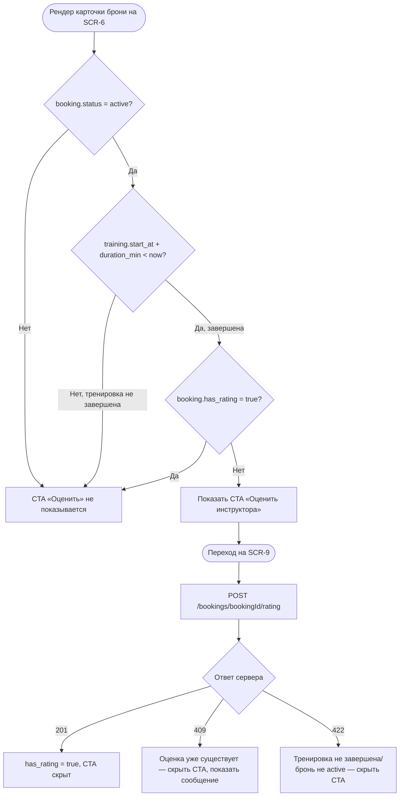

# Логика доступности оценки инструктора

**ID:** LOGIC-005
**Тип:** Логика
**Домен:** 09. Логики
**Приоритет:** Medium
**Статус:** На согласовании
**Функциональные блоки:** FB-RATING-AVAILABILITY

---

## История изменений

| Релиз | ТЗ | Описание изменений |
|-------|-----|-------------------|
| 0.1.0 | 06-my-bookings.md, 09-instructor-rating.md | Первоначальная документация |
| 0.1.1 | Решение по открытому вопросу №6 (см. `00-OPEN-QUESTIONS-LOG.md`) | Редактирование ранее оставленной оценки не реализуется в MVP — зафиксировано как принятое решение (не блокер) |

---

## Входные данные

| Название | Тип | Возможные значения | Описание |
|----------|-----|-------------------|----------|
| `booking.status` | Состояние (из API) | `active`, `cancelled`, `late_cancel`, `club_cancelled` | Оценка доступна только для `active` |
| `booking.has_rating` | Состояние (из API) | `true`/`false` | Признак того, что оценка уже оставлена |
| `training.start_at` + `training.duration_min` | Состояние (из API) | ISO date-time + минуты | Используется для определения, завершилась ли тренировка |

---

## Обзор

Определяет, когда клиенту показывается CTA «Оценить инструктора» в списке
«Мои бронирования» (SCR-6) и когда переход на SCR-9 действительно возможен.
Оценка доступна только после завершения тренировки и только один раз на
бронь (FR-22).

### User Story

> Как клиент, я хочу оставить оценку инструктору после завершения тренировки,
> но не хочу видеть предложение оценить тренировку, которая ещё не прошла или
> уже была оценена.

### Бизнес-ценность

- Своевременный сбор обратной связи об инструкторах (BR-10, Should-функция).
- Предотвращение повторных/некорректных оценок.

---

## Точки применения

| Экран/Компонент | Элемент/Триггер | Условие |
|-----------------|-----------------|---------|
| [SCR-6 Мои бронирования](../screens/SCR-6_my-bookings.md) | CTA «Оценить инструктора» в карточке брони | Для завершённых тренировок |
| [SCR-9 Оценка инструктора](../screens/SCR-9_instructor-rating.md) | Открытие формы оценки | При переходе с SCR-6 |

---

## Флоу

---

## Описание логики

### Шаг 1: Проверка статуса брони

Оценка доступна только для броней со статусом `active` (не отменённых
клиентом или скалодромом). Для остальных статусов CTA не показывается.

### Шаг 2: Проверка факта завершения тренировки

Тренировка считается завершённой, если `now > training.start_at +
training.duration_min`. До этого момента CTA скрыт, даже если статус брони
`active` (FR-22, альтернативный сценарий UC-8).

### Шаг 3: Проверка отсутствия ранее оставленной оценки

Если `booking.has_rating = true` — CTA скрыт: оценка однократна на бронь.
Редактирование ранее оставленной оценки принято решением не реализовывать
в MVP (см. `00-OPEN-QUESTIONS-LOG.md`, вопрос №6) — Should-функция сама по
себе, редактирование становится кандидатом в следующий релиз, а не блокером
текущего.

### Шаг 4: Отправка оценки и синхронизация состояния

После успешной отправки (`201`) локальное отображение обновляется —
`has_rating` считается `true`, CTA больше не показывается для этой брони
без дополнительного запроса к серверу (оптимистичное обновление на основе
успешного ответа).

---

## API запросы

### POST /bookings/{bookingId}/rating

**Тип:** REST
**Спецификация:** `openapi.yaml` → `operationId: createRating`

**Триггер:** Кнопка «Отправить» на SCR-9

**Параметры (Body):**

| Параметр | Тип | Обязательность | Источник | Описание |
|----------|-----|-----------------|----------|----------|
| `score` | integer (1–5) | Да | Выбор пользователя | Оценка по пятибалльной шкале (FR-20) |
| `comment` | string, ≤ 2000 симв. | Нет | Ввод пользователя | Текстовый отзыв (FR-21) |

**Обработка ответа:**

| Результат | Условие | UI-реакция |
|-----------|---------|------------|
| Загрузка | — | Лоадер на кнопке «Отправить» |
| 201 | Оценка сохранена | Экран успеха, возврат на SCR-6, CTA скрыт |
| 400 | Невалидные данные | Снек с текстом из `message` |
| 409 | Оценка по брони уже существует | Снек с текстом из `message`, CTA скрыт при последующем рендере |
| 422 | Тренировка не завершена / бронь не `active` | Снек с текстом из `message`, возврат на SCR-6 |
| 5xx / сеть | — | Снек "Произошла ошибка. Попробуйте позже" / "Нет соединения..." |

---

## Связанные требования

### Функциональные

| ID | Название | Приоритет |
|----|----------|-----------|
| FR-20 | Оценка инструктора по пятибалльной шкале | Medium |
| FR-21 | Текстовый отзыв (опционально) | Medium |
| FR-22 | Доступность оценки только после завершения тренировки | High |

### Данные

| ID | Название | Приоритет |
|----|----------|-----------|
| BR-10 | Оценка инструктора — Should-функция MVP | Medium |

---

## Критерии приёмки

| ID | Критерий |
|----|----------|
| AC-001 | **Дано** бронь `active` и тренировка ещё не завершена, **Когда** отображается SCR-6, **Тогда** CTA «Оценить» не показывается |
| AC-002 | **Дано** бронь `active`, тренировка завершена, оценка не оставлена, **Когда** отображается SCR-6, **Тогда** CTA «Оценить» показывается |
| AC-003 | **Дано** `has_rating = true`, **Когда** отображается SCR-6, **Тогда** CTA «Оценить» не показывается |
| AC-004 | **Дано** бронь отменена (`cancelled`/`late_cancel`/`club_cancelled`), **Когда** отображается SCR-6, **Тогда** CTA «Оценить» не показывается |
| AC-005 | **Дано** клиент отправил оценку успешно, **Когда** получен ответ 201, **Тогда** CTA скрывается без дополнительного запроса |
| AC-006 | **Дано** попытка повторной отправки оценки, **Когда** сервер возвращает 409, **Тогда** показано понятное сообщение и CTA скрыт |

---

## Обработка ошибок

| Тип ошибки | Контекст | Действие |
|------------|----------|----------|
| 422 (тренировка не завершена по мнению сервера) | Расхождение локального и серверного времени | Скрыть CTA, показать сообщение, обновить список бронирований |
| 409 (оценка уже существует) | Повторный переход на SCR-9 с устаревшим локальным состоянием | Показать сообщение, синхронизировать `has_rating` |

---
