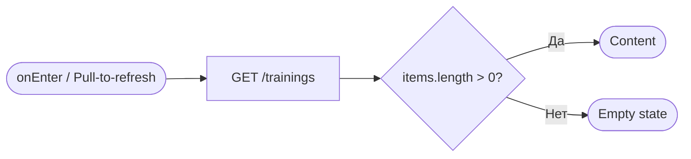
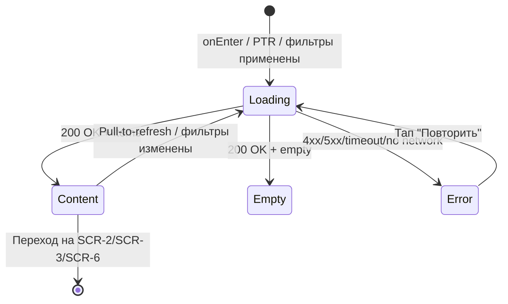

# Список тренировок (расписание)

**ID:** SCR-1
**Тип:** Экран
**Домен:** 01. Расписание
**Приоритет:** Critical
**Статус:** На согласовании
**Функциональные блоки:** FB-SCHEDULE-LIST
**Зона авторизации:** АЗ
**Дизайн-макет:** не приложен — требуется разработка в Figma

---

## Содержание

- [История изменений](#история-изменений)
- [Обзор](#обзор)
- [Навигация](#навигация)
- [Входные данные](#входные-данные)
- [Применяемые логики](#применяемые-логики)
- [Инициализация](#инициализация)
- [Используемые запросы](#используемые-запросы)
- [Макет экрана](#макет-экрана)
- [Элементы экрана](#элементы-экрана)
- [Состояния экрана](#состояния-экрана)
- [Действия пользователя](#действия-пользователя)
- [Связанные требования](#связанные-требования)
- [Критерии приёмки](#критерии-приёмки)

---

## История изменений

| Релиз | ТЗ | Описание изменений |
|-------|-----|-------------------|
| 0.1.0 | 01-schedule-list.md | Первоначальная документация |
| 0.1.1 | Решения по открытым вопросам №2 и №5 (см. `00-OPEN-QUESTIONS-LOG.md`) | Синхронизирован состав `activeFilters` с сокращённым MVP-набором фильтров (SCR-2); порог «мало мест» закреплён на `≤ 2`, вынесен в Remote Config |

---

## Обзор

Стартовый экран приложения и основная точка входа во весь клиентский флоу.
Отображает список доступных тренировок скалодрома, полученный от backend —
единственного источника данных о тренировках, инструкторах и свободных
местах (BR-11). Экран целиком read-only: создание, изменение и удаление
тренировок клиенту недоступно (NFR-14).

### User Story

> Как клиент, я хочу видеть список ближайших тренировок с ключевой
> информацией (дата, время, инструктор, цена, места), чтобы быстро найти
> подходящую и перейти к записи.

### Бизнес-ценность

- Главная точка входа в бизнес-процесс записи — от неё зависит конверсия
  в бронирование.
- Актуальность данных о местах напрямую влияет на количество неуспешных
  попыток записи и обращений в поддержку.
- Явные статусы «Мало мест» / «Мест нет» / «Отменена» снижают
  фрустрацию пользователя ещё до перехода в детали.

---

## Навигация

### Входящая (откуда открывается)

| Источник | Триггер | Условие | Передаваемые параметры |
|----------|---------|---------|------------------------|
| Нижняя навигация | Тап на вкладку «Расписание» | Всегда | — |
| Запуск приложения | Автоматически | Стартовый таб по умолчанию | — |
| [SCR-2 Фильтры расписания](./SCR-2_schedule-filters.md) | Кнопка «Применить» | Всегда | `filters` (объект выбранных параметров) |
| [SCR-3 Карточка тренировки](./SCR-3_training-details.md) | Системная кнопка «Назад» | Всегда | — |

### Исходящая (куда ведёт)

| Назначение | Триггер | Передаваемые параметры |
|------------|---------|------------------------|
| [SCR-2 Фильтры расписания](./SCR-2_schedule-filters.md) | Тап на иконку «Фильтры» | `currentFilters` (текущие применённые фильтры) |
| [SCR-3 Карточка тренировки](./SCR-3_training-details.md) | Тап по карточке тренировки | `trainingId` |
| [SCR-6 Мои бронирования](./SCR-6_my-bookings.md) | Тап на вкладку «Мои бронирования» в нижней навигации | — |

---

## Входные данные

| Название | Тип | Возможные значения | Описание |
|----------|-----|-------------------|----------|
| `activeFilters` | Состояние (in-memory, сбрасывается при перезапуске приложения) | объект: `date_from`, `date_to`, `only_available` | Текущие применённые фильтры (MVP-набор, см. [SCR-2](./SCR-2_schedule-filters.md)); для MVP не персистентны между сессиями — принятое решение, не открытый вопрос |

---

## Применяемые логики

| Логика | Элемент/Триггер | Описание |
|--------|-----------------|----------|
| [LOGIC-004 Доступность записи на тренировку](../logics/LOGIC-004_dostupnost-zapisi.md) | Карточка тренировки в списке | Определяет статус карточки: обычная / «мало мест» / «мест нет» / «отменена» |

---

## Инициализация

### Диаграмма загрузки



### Запросы при открытии

| № | Запрос | Критичный | Зависит от | Условие |
|---|--------|-----------|------------|---------|
| 1 | [GET /trainings](#get-trainings) | Да | — | Всегда, с текущими `activeFilters` в query |

> Полное описание запросов см. в секции [Используемые запросы](#используемые-запросы).

---

## Используемые запросы

### GET /trainings

**Тип:** REST
**Метод:** GET
**Спецификация:** `openapi.yaml` → `operationId: listTrainings`

**Триггер:** Инициализация экрана, pull-to-refresh, возврат с SCR-2 с новыми фильтрами, пагинация при скролле

**Параметры:**

| Параметр | Тип | Обязательность | Источник | Описание |
|----------|-----|-----------------|----------|----------|
| `date_from` | string (date) | Нет | `activeFilters.date_from` | Начало диапазона дат |
| `date_to` | string (date) | Нет | `activeFilters.date_to` | Конец диапазона дат |
| `only_available` | boolean | Нет | `activeFilters.only_available` | Только тренировки со свободными местами |
| `limit` | integer | Нет | Клиент, дефолт 20 | Размер страницы |
| `offset` | integer | Нет | Клиент, увеличивается при скролле | Пагинация |

> API также поддерживает `format` и `instructor_id` (см. `openapi.yaml` →
> `operationId: listTrainings`), но в MVP-версии UI (после решения по
> открытому вопросу №2) они не используются — задел для v2.

**Обработка ответа:**

| Результат | Условие | UI-реакция |
|-----------|---------|------------|
| Загрузка | Первая страница | Skeleton-плейсхолдеры карточек, экран интерактивен не позднее 2 сек (NFR-1) |
| Загрузка | Догрузка следующей страницы | Индикатор-лоадер внизу списка |
| Успех | `items` не пуст | Отобразить список карточек |
| Успех | `items` пуст | Empty state с предложением сбросить фильтры (если фильтры активны) |
| HTTP 401 | — | Переход на экран авторизации (см. открытый вопрос по SCR-0 в реестре экранов) |
| HTTP 5xx | — | Error state с кнопкой «Повторить» |
| Сеть | Нет соединения | Error state с кнопкой «Повторить»; не показывать устаревшие данные как актуальные (NFR-6) |

---

## Макет экрана

### Структура

```
┌─────────────────────────────────────┐
│ Расписание              [⚙ Фильтры] │  ← Header (бейдж кол-ва фильтров)
├─────────────────────────────────────┤
│  ┌───────────────────────────────┐  │
│  │ Карточка тренировки #1        │  │
│  └───────────────────────────────┘  │
│  ┌───────────────────────────────┐  │
│  │ Карточка тренировки #2        │  │  ← Scrollable, pull-to-refresh
│  └───────────────────────────────┘  │
│              ...                    │
├─────────────────────────────────────┤
│ [Расписание] [Мои бронирования]     │  ← Нижняя навигация
└─────────────────────────────────────┘
```

### Компоненты

| Компонент | Описание | Обязательность |
|-----------|----------|-----------------|
| Заголовок + иконка фильтра | Заголовок экрана, иконка с бейджем количества активных фильтров | Да |
| Список карточек тренировок | Вертикальный скролл, пагинация | Да |
| Нижняя навигация | Табы «Расписание» / «Мои бронирования» | Да |

---

## Элементы экрана

### 1. Карточка тренировки

| Элемент | Описание | Источник данных | Валидация | Действие |
|---------|----------|-----------------|-----------|----------|
| Дата и время начала | Локальное время скалодрома | `start_at` | — | — |
| Продолжительность | В минутах/часах | `duration_min` | — | — |
| Формат | «Обычная» / «Для новичков» | `format` | — | — |
| Инструктор | Имя и фото (read-only) | `instructor.name`, `instructor.avatar_url` | — | — |
| Стоимость | За одно место, RUB | `price` | — | — |
| Свободные места | Формат «5 из 16» | `free_seats`, `total_seats` | — | — |
| Статусная плашка | «Мало мест» / «Мест нет» / «Отменена» | Вычисляется через [LOGIC-004](../logics/LOGIC-004_dostupnost-zapisi.md) | — | — |
| Вся карточка | Тап открывает подробности | `id` | — | Открыть [SCR-3](./SCR-3_training-details.md) с `trainingId` |

**Логика:**
- Статусная плашка и доступность тапа: [LOGIC-004](../logics/LOGIC-004_dostupnost-zapisi.md) — определяет «мало мест»/«мест нет»/«отменена»; тап по отменённой тренировке всё равно открывает SCR-3 (для просмотра статуса), но кнопка записи там будет неактивна.

### 2. Иконка фильтров

| Элемент | Описание | Источник данных | Валидация | Действие |
|---------|----------|-----------------|-----------|----------|
| Иконка «Фильтры» | С бейджем количества активных параметров | `activeFilters` (count непустых полей) | — | Открыть [SCR-2](./SCR-2_schedule-filters.md) |

**Условия доступности:**
- Бейдж с числом отображается, только если `activeFilters` содержит хотя бы одно непустое значение.

---

## Состояния экрана

### Таблица состояний

| Состояние | Условие | Отображение |
|-----------|---------|-------------|
| Loading | Первичная загрузка / pull-to-refresh | Skeleton-карточки |
| Content | `GET /trainings` 200 + `items` не пуст | Список карточек |
| Empty (без фильтров) | 200 + `items` пуст, фильтры не активны | «Пока нет доступных тренировок» |
| Empty (с фильтрами) | 200 + `items` пуст, фильтры активны | «Нет тренировок по заданным фильтрам» + кнопка «Сбросить фильтры» |
| Error | 4xx/5xx/таймаут/нет сети | Сообщение об ошибке + кнопка «Повторить» |
| Активные фильтры | `activeFilters` непустой | Бейдж с количеством фильтров рядом с иконкой |

### Диаграмма переходов



---

## Действия пользователя

| Действие | Элемент | Триггер | Результат |
|----------|---------|---------|-----------|
| Прокрутка списка | Список карточек | Swipe | Догрузка следующей страницы при достижении конца (пагинация) |
| Обновление списка | Весь экран | Pull-to-refresh | Повторный запрос `GET /trainings` с текущими фильтрами |
| Открыть фильтры | Иконка «Фильтры» | Tap | Переход на [SCR-2](./SCR-2_schedule-filters.md) |
| Открыть подробности | Карточка тренировки | Tap | Переход на [SCR-3](./SCR-3_training-details.md) |
| Перейти к бронированиям | Таб нижней навигации | Tap | Переход на [SCR-6](./SCR-6_my-bookings.md) |
| Сбросить фильтры | Кнопка в Empty state | Tap | Очистить `activeFilters`, повторный запрос без фильтров |

---

## Связанные требования

### Функциональные

| ID | Название | Приоритет |
|----|----------|-----------|
| FR-1 | Просмотр списка доступных тренировок | Critical |
| FR-2 | Состав отображаемой информации о тренировке | Critical |
| FR-4 | Возможность фильтрации списка | High |

### UI

| ID | Название | Приоритет |
|----|----------|-----------|
| NFR-1 | Экран интерактивен не более 2 сек при стабильном соединении | High |
| NFR-11 | Адаптация под смартфоны, без горизонтальной прокрутки | High |
| NFR-13 | Skeleton при загрузке | Medium |

### Данные

| ID | Название | Приоритет |
|----|----------|-----------|
| BR-4 | Просмотр расписания — базовая функция | Critical |
| BR-11 | Backend — единственный источник данных о тренировках | Critical |
| NFR-6 | Данные не кэшируются как источник истины дольше сессии | Critical |
| NFR-9 | Клиент видит только собственные данные (для бронирований) | Critical |

---

## Критерии приёмки

### Позитивные сценарии

| ID | Критерий | Приоритет |
|----|----------|-----------|
| AC-001 | **Дано** backend доступен, **Когда** клиент открывает экран, **Тогда** список тренировок отображается не позднее 2 секунд | P0 |
| AC-002 | **Дано** тренировка с `free_seats ≤ 2`, **Когда** отображается карточка, **Тогда** показан визуальный сигнал «мало мест» | P1 |
| AC-003 | **Дано** тренировка с `free_seats = 0`, **Когда** отображается карточка, **Тогда** показан статус «Мест нет» без возможности перейти к записи | P0 |
| AC-004 | **Дано** тренировка отменена скалодромом, **Когда** отображается карточка, **Тогда** показан статус «Отменена» | P0 |
| AC-005 | **Дано** применены фильтры на SCR-2, **Когда** клиент возвращается на SCR-1, **Тогда** список обновлён и показан бейдж количества фильтров | P1 |

### Негативные сценарии

| ID | Критерий | Приоритет |
|----|----------|-----------|
| AC-N01 | **Дано** backend недоступен, **Когда** открытие экрана, **Тогда** отображается error state с кнопкой «Повторить» | P0 |
| AC-N02 | **Дано** нет тренировок по заданным фильтрам, **Когда** список загружен, **Тогда** отображается empty state с предложением сбросить фильтры | P1 |

### Граничные условия

| ID | Критерий | Приоритет |
|----|----------|-----------|
| AC-E01 | **Дано** список прокручен до конца, **Когда** есть следующая страница, **Тогда** подгружаются дополнительные тренировки без дублирования | P2 |
| AC-E02 | **Дано** во время pull-to-refresh пропало соединение, **Когда** запрос завершается ошибкой, **Тогда** старые данные остаются видимыми и показывается ненавязчивое сообщение об ошибке | P2 |

---
