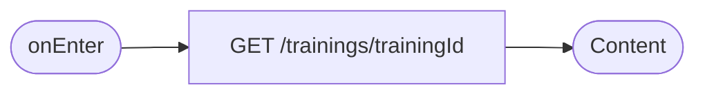
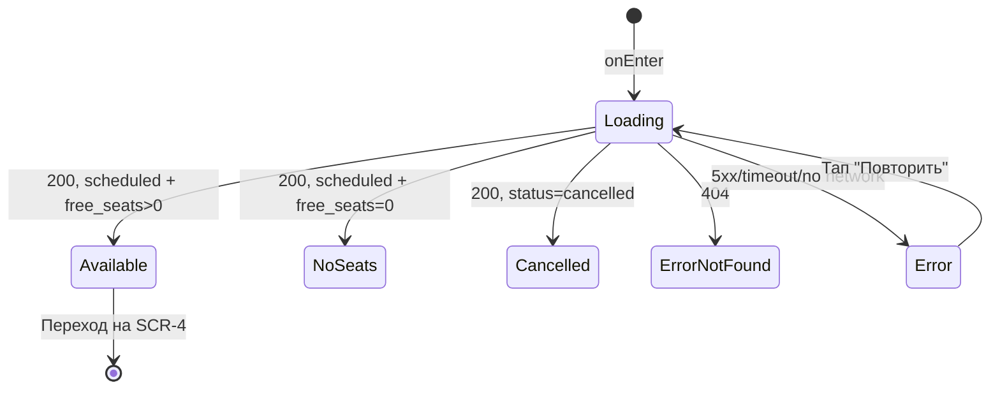

# Карточка тренировки (подробная информация)

**ID:** SCR-3
**Тип:** Экран
**Домен:** 01. Расписание
**Приоритет:** Critical
**Статус:** На согласовании
**Функциональные блоки:** FB-TRAINING-DETAILS
**Зона авторизации:** АЗ
**Дизайн-макет:** не приложен — требуется разработка в Figma

---

## Содержание

- [История изменений](#история-изменений)
- [Обзор](#обзор)
- [Навигация](#навигация)
- [Входные данные](#входные-данные)
- [Применяемые логики](#применяемые-логики)
- [Инициализация](#инициализация)
- [Используемые запросы](#используемые-запросы)
- [Макет экрана](#макет-экрана)
- [Элементы экрана](#элементы-экрана)
- [Состояния экрана](#состояния-экрана)
- [Действия пользователя](#действия-пользователя)
- [Связанные требования](#связанные-требования)
- [Критерии приёмки](#критерии-приёмки)

---

## История изменений

| Релиз | ТЗ | Описание изменений |
|-------|-----|-------------------|
| 0.1.0 | 03-training-details.md | Первоначальная документация |

---

## Обзор

Экран подробной информации о выбранной тренировке. Отображает все данные,
необходимые клиенту для принятия решения о записи, включая справочную
политику отмены. Целиком read-only относительно самой тренировки (NFR-14).

### User Story

> Как клиент, я хочу увидеть полную информацию о тренировке — время,
> инструктора, стоимость, свободные места и условия отмены — прежде чем
> принять решение о записи.

### Бизнес-ценность

- Снижает количество отмен «по незнанию условий» за счёт заблаговременного
  информирования о политике отмены.
- Явный статус недоступности (мест нет / отменена) экономит время клиента.

---

## Навигация

### Входящая (откуда открывается)

| Источник | Триггер | Условие | Передаваемые параметры |
|----------|---------|---------|------------------------|
| [SCR-1 Список тренировок](./SCR-1_schedule-list.md) | Тап по карточке тренировки | Всегда | `trainingId` |

### Исходящая (куда ведёт)

| Назначение | Триггер | Передаваемые параметры |
|------------|---------|------------------------|
| [SCR-4 Оформление записи](./SCR-4_booking-form.md) | Кнопка «Записаться» | `trainingId` |
| [SCR-1 Список тренировок](./SCR-1_schedule-list.md) | Системная кнопка «Назад» | — |

---

## Входные данные

| Название | Тип | Возможные значения | Описание |
|----------|-----|-------------------|----------|
| `trainingId` | Параметр навигации | UUID | ID тренировки для запроса подробностей |

---

## Применяемые логики

| Логика | Элемент/Триггер | Описание |
|--------|-----------------|----------|
| [LOGIC-004 Доступность записи на тренировку](../logics/LOGIC-004_dostupnost-zapisi.md) | Кнопка «Записаться» | Определяет активность/видимость кнопки в зависимости от `status`/`free_seats` |
| [LOGIC-002 Политика отмены](../logics/LOGIC-002_politika-otmeny.md) | Информационный блок «Политика отмены» | Отображение условия «бесплатно за 2 часа» как справки |

---

## Инициализация

### Диаграмма загрузки



### Запросы при открытии

| № | Запрос | Критичный | Зависит от | Условие |
|---|--------|-----------|------------|---------|
| 1 | [GET /trainings/{trainingId}](#get-trainingstrainingid) | Да | — | Всегда |

---

## Используемые запросы

### GET /trainings/{trainingId}

**Тип:** REST
**Метод:** GET
**Спецификация:** `openapi.yaml` → `operationId: getTraining`

**Триггер:** Инициализация экрана

**Параметры:**

| Параметр | Тип | Обязательность | Источник | Описание |
|----------|-----|-----------------|----------|----------|
| `trainingId` | string (uuid) | Да | Параметр навигации | ID тренировки |

**Обработка ответа:**

| Результат | Условие | UI-реакция |
|-----------|---------|------------|
| Загрузка | — | Skeleton блоков контента |
| Успех | `status = scheduled`, `free_seats > 0` | Полный контент, кнопка «Записаться» активна |
| Успех | `status = scheduled`, `free_seats = 0` | Контент + статус «Мест нет», кнопка неактивна |
| Успех | `status = cancelled` | Контент + баннер «Тренировка отменена», кнопка скрыта/неактивна (FR-19) |
| HTTP 404 | Тренировка не найдена | Error state «Тренировка не найдена» с кнопкой возврата на SCR-1 |
| HTTP 401 | — | Переход на экран авторизации |
| HTTP 5xx / сеть | — | Error state с кнопкой «Повторить» |

---

## Макет экрана

### Структура

```
┌─────────────────────────────────────┐
│ [←] Тренировка                      │  ← Header
├─────────────────────────────────────┤
│ Дата, время, продолжительность      │
│ Формат (Обычная / Для новичков)     │
│ Инструктор: фото + имя              │
│ Стоимость                           │
│ Свободные места (5 из 16)           │
│ Доступность проката оборудования    │
│ Политика отмены (справка)           │
├─────────────────────────────────────┤
│        [Записаться] / [Мест нет]    │  ← Fixed bottom
└─────────────────────────────────────┘
```

### Компоненты

| Компонент | Описание | Обязательность |
|-----------|----------|-----------------|
| Блок ключевых параметров | Дата, время, продолжительность, формат | Да |
| Блок инструктора | Имя, фото | Да |
| Блок стоимости и мест | Цена, `free_seats`/`total_seats` | Да |
| Блок проката оборудования | Доступность на основании `free_rental_kits` | Да |
| Информационный блок политики отмены | Текст-справка | Да |
| Кнопка «Записаться» / статус | Fixed bottom | Да |

---

## Элементы экрана

### 1. Информация о тренировке

| Элемент | Описание | Источник данных | Валидация | Действие |
|---------|----------|-----------------|-----------|----------|
| Дата и время | Локальное время | `start_at` | — | — |
| Продолжительность | В минутах | `duration_min` | — | — |
| Формат | «Обычная» (≤16) / «Для новичков» (≤8) | `format`, `total_seats` | — | — |
| Инструктор | Имя, фото | `instructor.name`, `instructor.avatar_url` | — | — |
| Стоимость | За одно место | `price` | — | — |
| Свободные места | «5 из 16» | `free_seats`/`total_seats` | — | — |
| Доступность проката | «Доступно» / «Недостаточно комплектов» | `free_rental_kits` | — | — |
| Политика отмены | Статичный информационный текст «Бесплатная отмена не позднее чем за 2 часа до начала» | Статично | — | — |

### 2. CTA-блок

| Элемент | Описание | Источник данных | Валидация | Действие |
|---------|----------|-----------------|-----------|----------|
| Кнопка «Записаться» | Primary button, fixed bottom | — | — | Открыть [SCR-4](./SCR-4_booking-form.md) с `trainingId` |
| Статус «Мест нет» | Заменяет кнопку | `free_seats = 0` | — | — |
| Баннер «Тренировка отменена» | Заменяет CTA-блок целиком | `status = cancelled` | — | — |

**Логика:**
- Кнопка «Записаться»: [LOGIC-004](../logics/LOGIC-004_dostupnost-zapisi.md) — активна только при `status = scheduled` и `free_seats > 0`.

**Условия доступности:**
- Кнопка «Записаться» видима и активна, если: `status = scheduled` И `free_seats > 0`.
- При `status = cancelled` — кнопка скрыта, вместо неё баннер отмены на всю ширину CTA-блока.
- При `free_seats = 0` (и `status = scheduled`) — кнопка заменяется на неактивный статус «Мест нет».

---

## Состояния экрана

### Таблица состояний

| Состояние | Условие | Отображение |
|-----------|---------|-------------|
| Loading | Ожидание `GET /trainings/{trainingId}` | Skeleton блоков |
| Content — доступна запись | `scheduled`, `free_seats > 0` | Полный контент + активная кнопка |
| Content — мест нет | `scheduled`, `free_seats = 0` | Контент + статус «Мест нет» |
| Content — отменена | `status = cancelled` | Контент + баннер «Тренировка отменена», запись заблокирована |
| Error — не найдена | 404 | Сообщение «Тренировка не найдена», кнопка «К расписанию» |
| Error — сеть/сервер | 5xx / нет сети | Сообщение об ошибке с кнопкой «Повторить» |

### Диаграмма переходов



---

## Действия пользователя

| Действие | Элемент | Триггер | Результат |
|----------|---------|---------|-----------|
| Записаться | Кнопка «Записаться» | Tap | Переход на [SCR-4](./SCR-4_booking-form.md), доступно только при наличии мест |
| Вернуться к списку | Системная кнопка «Назад» | Tap/Swipe | Возврат на [SCR-1](./SCR-1_schedule-list.md) |
| Повторить загрузку | Кнопка «Повторить» в error state | Tap | Повторный запрос `GET /trainings/{trainingId}` |

---

## Связанные требования

### Функциональные

| ID | Название | Приоритет |
|----|----------|-----------|
| FR-3 | Просмотр подробной информации о тренировке | Critical |
| FR-8 | Блокировка записи при отсутствии мест | Critical |
| FR-9 | Отображение доступности проката оборудования | High |
| FR-19 | Блокировка записи на отменённую тренировку | Critical |

### Данные

| ID | Название | Приоритет |
|----|----------|-----------|
| BR-4 | Просмотр расписания — базовая функция | Critical |
| NFR-6 | Актуальность данных на момент показа | Critical |
| NFR-14 | Только просмотр, без редактирования | Critical |

---

## Критерии приёмки

### Позитивные сценарии

| ID | Критерий | Приоритет |
|----|----------|-----------|
| AC-001 | **Дано** тренировка доступна и есть места, **Когда** клиент открывает SCR-3, **Тогда** отображается полная информация и активная кнопка «Записаться» | P0 |
| AC-002 | **Дано** клиент нажал «Записаться», **Когда** переход выполнен, **Тогда** открывается SCR-4 с корректным `trainingId` | P0 |

### Негативные сценарии

| ID | Критерий | Приоритет |
|----|----------|-----------|
| AC-N01 | **Дано** `free_seats = 0`, **Когда** экран открыт, **Тогда** кнопка «Записаться» заменена статусом «Мест нет» и недоступна | P0 |
| AC-N02 | **Дано** тренировка отменена скалодромом, **Когда** экран открыт, **Тогда** отображается баннер «Тренировка отменена», запись заблокирована | P0 |
| AC-N03 | **Дано** сервер вернул 404, **Когда** экран открыт, **Тогда** показано сообщение «Тренировка не найдена» с возможностью вернуться к расписанию | P1 |

### Граничные условия

| ID | Критерий | Приоритет |
|----|----------|-----------|
| AC-E01 | **Дано** тренировку отменили, пока клиент уже находится на SCR-3 (устаревшие локальные данные), **Когда** клиент нажимает «Записаться», **Тогда** запрос на SCR-4/бэкенде вернёт актуальную ошибку (410), а не создаст бронь | P1 |

---
