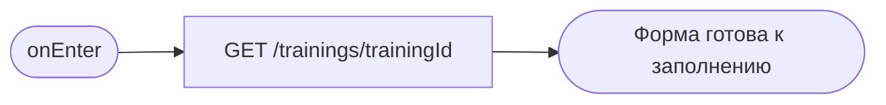
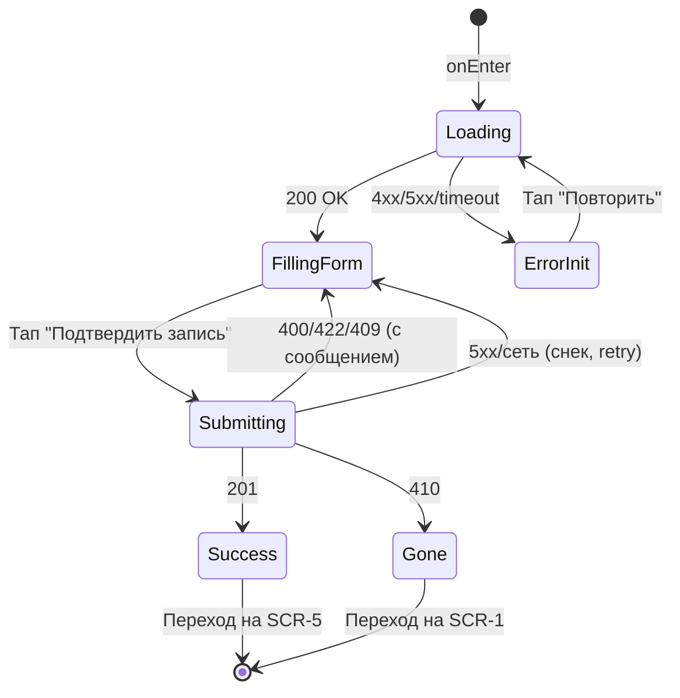

# Оформление записи на тренировку

**ID:** SCR-4
**Тип:** Экран
**Домен:** 02. Бронирование
**Приоритет:** Critical
**Статус:** На согласовании
**Функциональные блоки:** FB-BOOKING-CREATE
**Зона авторизации:** АЗ
**Дизайн-макет:** не приложен — требуется разработка в Figma

---

## Содержание

- [История изменений](#история-изменений)
- [Обзор](#обзор)
- [Навигация](#навигация)
- [Входные данные](#входные-данные)
- [Применяемые логики](#применяемые-логики)
- [Инициализация](#инициализация)
- [Используемые запросы](#используемые-запросы)
- [Макет экрана](#макет-экрана)
- [Элементы экрана](#элементы-экрана)
- [Состояния экрана](#состояния-экрана)
- [Действия пользователя](#действия-пользователя)
- [Связанные требования](#связанные-требования)
- [Критерии приёмки](#критерии-приёмки)

---

## История изменений

| Релиз | ТЗ | Описание изменений |
|-------|-----|-------------------|
| 0.1.0 | 04-booking-form.md | Первоначальная документация |
| 0.1.1 | Решения по открытым вопросам №3 и №4 (см. `00-OPEN-QUESTIONS-LOG.md`) | Формула расчёта итоговой стоимости `price × participants_count` и выбор оборудования на бронь целиком зафиксированы как принятые решения, а не допущения |

---

## Обзор

Ключевой экран основного бизнес-процесса — оформление брони на тренировку.
Клиент указывает количество участников (до трёх, включая себя) и выбирает
вариант оборудования, после чего подтверждает запись. Экран не изменяет саму
тренировку (NFR-14) и не запрашивает данные для онлайн-оплаты (BR-13).

### User Story

> Как клиент, я хочу указать число участников и выбрать оборудование, чтобы
> оформить бронь на выбранную тренировку.

### Бизнес-ценность

- Основной шаг конверсии в подтверждённую бронь — от качества UX здесь
  напрямую зависит завершаемость записи (NFR-10: сценарий в пределах трёх
  экранов SCR-3 → SCR-4 → SCR-5).
- Явная проверка мест и проката до отправки снижает долю ошибок 409/410.

---

## Навигация

### Входящая (откуда открывается)

| Источник | Триггер | Условие | Передаваемые параметры |
|----------|---------|---------|------------------------|
| [SCR-3 Карточка тренировки](./SCR-3_training-details.md) | Кнопка «Записаться» | `free_seats > 0` и `status = scheduled` | `trainingId` |

### Исходящая (куда ведёт)

| Назначение | Триггер | Передаваемые параметры |
|------------|---------|------------------------|
| [SCR-5 Подтверждение записи](./SCR-5_booking-confirmation.md) | Успешное создание брони (201) | `bookingId` (созданная бронь) |
| [SCR-3 Карточка тренировки](./SCR-3_training-details.md) | Кнопка «Отмена» / «Назад» | — |
| [SCR-1 Список тренировок](./SCR-1_schedule-list.md) | Ошибка 409/410 → кнопка «К расписанию» | — |

---

## Входные данные

| Название | Тип | Возможные значения | Описание |
|----------|-----|-------------------|----------|
| `trainingId` | Параметр навигации | UUID | Тренировка, на которую оформляется бронь |
| `participantsCount` | Локальное состояние формы | 1–3 | По умолчанию 1 (сам клиент) |
| `equipmentType` | Локальное состояние формы | `own`, `rental` | Выбор варианта оборудования на всю бронь целиком (принятое решение по вопросу №4, см. `00-OPEN-QUESTIONS-LOG.md`; закреплено в контракте `openapi.yaml` — `equipment_type` на уровне `Booking`) |

---

## Применяемые логики

| Логика | Элемент/Триггер | Описание |
|--------|-----------------|----------|
| [LOGIC-004 Доступность записи на тренировку](../logics/LOGIC-004_dostupnost-zapisi.md) | Степпер участников, переключатель оборудования, кнопка подтверждения | Валидация количества участников относительно `free_seats`, доступности проката, обработка 409/410 |

---

## Инициализация

### Диаграмма загрузки



### Запросы при открытии

| № | Запрос | Критичный | Зависит от | Условие |
|---|--------|-----------|------------|---------|
| 1 | GET /trainings/{trainingId} | Да | — | Всегда — получить актуальные `price`, `free_seats`, `free_rental_kits` для контекстного блока и валидации (данные с SCR-3 могли устареть) |

> Спецификация запроса идентична описанной на [SCR-3](./SCR-3_training-details.md#get-trainingstrainingid).

---

## Используемые запросы

### POST /bookings

**Тип:** REST
**Метод:** POST
**Спецификация:** `openapi.yaml` → `operationId: createBooking`

**Триггер:** Кнопка «Подтвердить запись»

**Параметры (Body):**

| Параметр | Тип | Обязательность | Источник | Описание |
|----------|-----|-----------------|----------|----------|
| `training_id` | string (uuid) | Да | `trainingId` | ID тренировки |
| `participants_count` | integer (1–3) | Да | `participantsCount` | FR-7 |
| `equipment_type` | `own`\|`rental` | Да | `equipmentType` | FR-6 |

**Обработка ответа:**

| Результат | Условие | UI-реакция |
|-----------|---------|------------|
| Загрузка | — | Лоадер на кнопке подтверждения, отклик ≤ 3 сек (NFR-2) |
| Успех 201 | Бронь создана | Переход на [SCR-5](./SCR-5_booking-confirmation.md) с `bookingId` |
| 400/422 | Невалидные данные (напр. `participants_count` вне 1–3) | Снек с текстом из `message`, форма не сбрасывается |
| 409 | `slot_full`/`rental_unavailable` (см. [LOGIC-004](../logics/LOGIC-004_dostupnost-zapisi.md)) | Снек с сообщением, обновить `free_seats`/`free_rental_kits` из `details`, кнопка подтверждения блокируется, если новых мест недостаточно |
| 410 | Тренировка отменена скалодромом | Сообщение «Тренировка отменена», кнопка «К расписанию» → [SCR-1](./SCR-1_schedule-list.md) |
| 401 | — | Переход на экран авторизации |
| 5xx / сеть | — | Снек «Произошла ошибка. Попробуйте позже» / «Нет соединения...», данные формы сохраняются, доступен повтор |

---

## Макет экрана

### Структура

```
┌─────────────────────────────────────┐
│ [←] Оформление записи               │  ← Header
├─────────────────────────────────────┤
│ Тренировка: дата, время, инструктор │  ← Read-only контекст
│ Стоимость за место: {price} ₽       │
├─────────────────────────────────────┤
│ Количество участников: [-] 1 [+]    │
│ Оборудование:                       │
│  ( ) Своё оборудование              │
│  ( ) Прокат скалодрома              │
├─────────────────────────────────────┤
│ Итого: {price × participantsCount}₽ │
├─────────────────────────────────────┤
│         [Подтвердить запись]        │  ← Fixed bottom
└─────────────────────────────────────┘
```

### Компоненты

| Компонент | Описание | Обязательность |
|-----------|----------|-----------------|
| Блок контекста тренировки | Read-only сводка | Да |
| Степпер количества участников | Кнопки +/-, диапазон 1–3, ограничен `free_seats` | Да |
| Радио-группа оборудования | «Своё» / «Прокат» | Да |
| Блок итоговой стоимости | `price × participantsCount` (закреплённая формула расчёта) | Да |
| Кнопка подтверждения | Fixed bottom, primary | Да |

---

## Элементы экрана

### 1. Контекст тренировки (read-only)

| Элемент | Описание | Источник данных | Валидация | Действие |
|---------|----------|-----------------|-----------|----------|
| Дата, время, инструктор | Сводка | `training.start_at`, `training.instructor.name` | — | — |
| Стоимость за место | | `training.price` | — | — |

### 2. Выбор участников и оборудования

| Элемент | Описание | Источник данных | Валидация | Действие |
|---------|----------|-----------------|-----------|----------|
| Степпер «Количество участников» | +/- в диапазоне 1–3 | `participantsCount` | Не более 3 (FR-7); не более `training.free_seats` (FR-8). Ошибка: «Недостаточно свободных мест» | Обновляет `participantsCount` и пересчитывает итоговую стоимость |
| Радио «Своё оборудование» | Выбор варианта | `equipmentType = own` | — | Обновляет `equipmentType` |
| Радио «Прокат скалодрома» | Выбор варианта, недоступен при нехватке комплектов | `equipmentType = rental`, доступность из `training.free_rental_kits` | Недоступно, если `free_rental_kits < participantsCount` (FR-9). Ошибка: «Прокат недоступен на выбранное количество участников» | Обновляет `equipmentType` |
| Блок «Итого» | Итоговая стоимость | `price × participantsCount` | — | — |
| Кнопка «Подтвердить запись» | Primary button | — | — | Валидация → [POST /bookings](#post-bookings) |

**Логика:**
- Валидация количества участников, доступности проката и обработка конфликтов: [LOGIC-004](../logics/LOGIC-004_dostupnost-zapisi.md).

**Момент валидации:** При изменении степпера/радио-группы (немедленно) и повторно при отправке формы (актуализация относительно ответа `GET /trainings/{trainingId}` при инициализации).

**Условия доступности:**
- Кнопка «Подтвердить запись» активна, если: `1 ≤ participantsCount ≤ min(3, training.free_seats)` И (`equipmentType = own` ИЛИ (`equipmentType = rental` И `free_rental_kits ≥ participantsCount`)).
- Вариант «Прокат скалодрома» визуально помечен недоступным (disabled), если `free_rental_kits < participantsCount`.

---

## Состояния экрана

### Таблица состояний

| Состояние | Условие | Отображение |
|-----------|---------|-------------|
| Loading | Ожидание `GET /trainings/{trainingId}` при инициализации | Skeleton контекстного блока |
| Заполнение формы | Данные тренировки получены | Интерактивная форма |
| Отправка | После нажатия «Подтвердить запись» | Лоадер на кнопке, форма заблокирована от повторной отправки |
| Успех | 201 | Переход на SCR-5 |
| Ошибка — мест не осталось | 409 | Снек + подсветка степпера участников с актуальным числом мест |
| Ошибка — тренировка отменена | 410 | Полноэкранное сообщение + кнопка «К расписанию» |
| Ошибка сети/сервера | 5xx / нет сети | Снек с сообщением, данные формы сохранены, доступен повтор |

### Диаграмма переходов



---

## Действия пользователя

| Действие | Элемент | Триггер | Результат |
|----------|---------|---------|-----------|
| Изменить количество участников | Степпер | Tap +/- | Обновление `participantsCount`, пересчёт стоимости, ревалидация оборудования |
| Выбрать оборудование | Радио-группа | Tap | Обновление `equipmentType` |
| Подтвердить запись | Кнопка «Подтвердить запись» | Tap | Валидация → `POST /bookings` |
| Отменить оформление | Кнопка «Назад» | Tap | Возврат на [SCR-3](./SCR-3_training-details.md) без создания брони |

---

## Связанные требования

### Функциональные

| ID | Название | Приоритет |
|----|----------|-----------|
| FR-5 | Оформление записи на тренировку | Critical |
| FR-6 | Выбор варианта оборудования | Critical |
| FR-7 | Ограничение — не более 3 участников | Critical |
| FR-8 | Проверка свободных мест | Critical |
| FR-9 | Проверка доступности проката | High |

### Данные

| ID | Название | Приоритет |
|----|----------|-----------|
| BR-2, BR-6, BR-7 | Ограничения бизнес-процесса записи | Critical |
| NFR-2 | Отклик подтверждения ≤ 3 сек | High |
| NFR-4 | Недопустимость двойных бронирований | Critical |
| NFR-10 | Сценарий записи в пределах трёх экранов | Medium |

---

## Критерии приёмки

### Позитивные сценарии

| ID | Критерий | Приоритет |
|----|----------|-----------|
| AC-001 | **Дано** есть свободные места, **Когда** клиент указывает 1–3 участников и подтверждает запись, **Тогда** бронь успешно создаётся и происходит переход на SCR-5 | P0 |
| AC-002 | **Дано** выбран прокат оборудования при достаточном количестве комплектов, **Когда** клиент подтверждает запись, **Тогда** бронь создаётся с `equipment_type=rental` | P1 |

### Негативные сценарии

| ID | Критерий | Приоритет |
|----|----------|-----------|
| AC-N01 | **Дано** клиент пытается указать более 3 участников, **Когда** он нажимает "+", **Тогда** степпер не позволяет превысить 3 | P0 |
| AC-N02 | **Дано** `free_seats < participantsCount` на момент отправки (гонка), **Когда** сервер возвращает 409, **Тогда** показывается понятное сообщение, форма не сбрасывается | P0 |
| AC-N03 | **Дано** тренировка отменена скалодромом между SCR-3 и отправкой формы, **Когда** сервер возвращает 410, **Тогда** клиент видит сообщение об отмене и направляется на SCR-1 | P0 |
| AC-N04 | **Дано** недостаточно прокатных комплектов, **Когда** клиент пытается выбрать «Прокат», **Тогда** вариант помечен недоступным | P1 |

### Граничные условия

| ID | Критерий | Приоритет |
|----|----------|-----------|
| AC-E01 | **Дано** сбой сети во время отправки формы, **Когда** соединение восстанавливается, **Тогда** данные формы сохранены и доступен повторный сабмит | P2 |
| AC-E02 | **Дано** `free_seats = 1`, **Когда** клиент пытается указать 2 участников, **Тогда** степпер ограничивает максимум одним участником | P1 |

---
