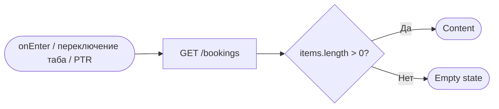
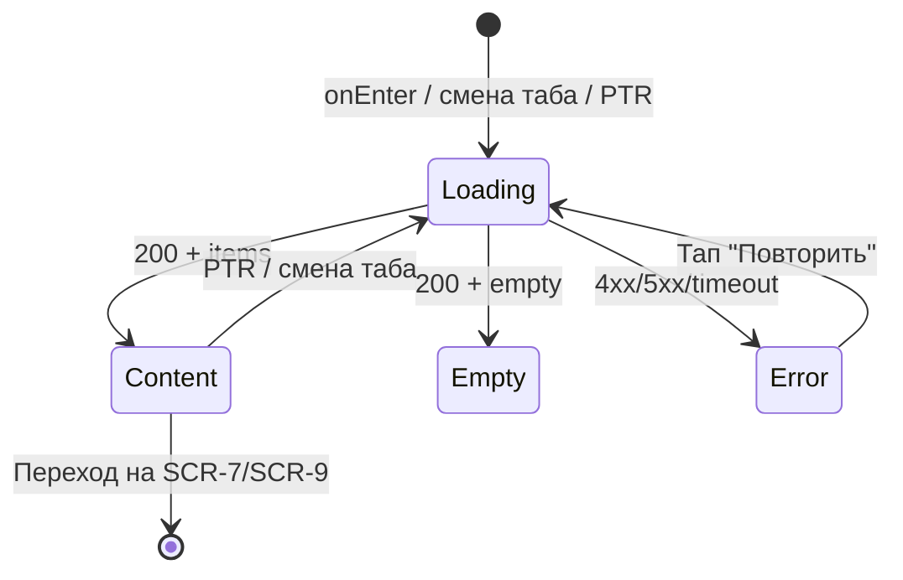

# Мои бронирования

**ID:** SCR-6
**Тип:** Экран
**Домен:** 02. Бронирование
**Приоритет:** Critical
**Статус:** На согласовании
**Функциональные блоки:** FB-MY-BOOKINGS
**Зона авторизации:** АЗ
**Дизайн-макет:** не приложен — требуется разработка в Figma

---

## Содержание

- [История изменений](#история-изменений)
- [Обзор](#обзор)
- [Навигация](#навигация)
- [Входные данные](#входные-данные)
- [Применяемые логики](#применяемые-логики)
- [Инициализация](#инициализация)
- [Используемые запросы](#используемые-запросы)
- [Макет экрана](#макет-экрана)
- [Элементы экрана](#элементы-экрана)
- [Состояния экрана](#состояния-экрана)
- [Действия пользователя](#действия-пользователя)
- [Связанные требования](#связанные-требования)
- [Критерии приёмки](#критерии-приёмки)

---

## История изменений

| Релиз | ТЗ | Описание изменений |
|-------|-----|-------------------|
| 0.1.0 | 06-my-bookings.md | Первоначальная документация |

---

## Обзор

Экран со списком всех бронирований клиента и их текущими статусами.
Единственная точка, откуда клиент управляет своими будущими тренировками —
переходит к деталям/отмене или к оценке инструктора по завершённым.

### User Story

> Как клиент, я хочу видеть список всех своих бронирований со статусами,
> чтобы контролировать предстоящие тренировки и управлять ими.

### Бизнес-ценность

- Центральная точка контроля клиентом собственных броней снижает нагрузку
  на поддержку.
- Явное разделение предстоящих/прошедших повышает удобство при большом
  количестве записей.

---

## Навигация

### Входящая (откуда открывается)

| Источник | Триггер | Условие | Передаваемые параметры |
|----------|---------|---------|------------------------|
| Нижняя навигация | Тап на вкладку «Мои бронирования» | Всегда | — |
| [SCR-5 Подтверждение записи](./SCR-5_booking-confirmation.md) | Кнопка «Мои бронирования» | Всегда | — |
| Push-уведомление ([SCR-8](./SCR-8_cancellation-notification.md)) | Тап по уведомлению | `booking_id` не определён в пейлоаде | — |

### Исходящая (куда ведёт)

| Назначение | Триггер | Передаваемые параметры |
|------------|---------|------------------------|
| [SCR-7 Детали бронирования / Отмена](./SCR-7_booking-details-cancel.md) | Тап по карточке брони | `bookingId` |
| [SCR-9 Оценка инструктора](./SCR-9_instructor-rating.md) | CTA «Оценить инструктора» на завершённой брони | `bookingId` |
| [SCR-1 Список тренировок](./SCR-1_schedule-list.md) | Кнопка в Empty state «Перейти к расписанию» | — |

---

## Входные данные

| Название | Тип | Возможные значения | Описание |
|----------|-----|-------------------|----------|
| `activeTab` | Локальное состояние UI | `upcoming`, `past` | Переключатель «Предстоящие» / «Прошедшие», управляет параметром `upcoming` в запросе |

---

## Применяемые логики

| Логика | Элемент/Триггер | Описание |
|--------|-----------------|----------|
| [LOGIC-001 Статусы и бейджи брони](../logics/LOGIC-001_status-broni.md) | Бейдж статуса в карточке | Единое отображение статуса брони |
| [LOGIC-005 Доступность оценки инструктора](../logics/LOGIC-005_dostupnost-ocenki.md) | CTA «Оценить инструктора» | Показ CTA только для завершённых неоценённых броней |

---

## Инициализация

### Диаграмма загрузки



### Запросы при открытии

| № | Запрос | Критичный | Зависит от | Условие |
|---|--------|-----------|------------|---------|
| 1 | [GET /bookings](#get-bookings) | Да | — | Всегда, с `upcoming` согласно `activeTab` |

---

## Используемые запросы

### GET /bookings

**Тип:** REST
**Метод:** GET
**Спецификация:** `openapi.yaml` → `operationId: listBookings`

**Триггер:** Инициализация, переключение таба «Предстоящие/Прошедшие», pull-to-refresh, возврат с SCR-7/SCR-9

**Параметры:**

| Параметр | Тип | Обязательность | Источник | Описание |
|----------|-----|-----------------|----------|----------|
| `upcoming` | boolean | Нет | `activeTab` (`true` для «Предстоящие», `false` для «Прошедшие») | Фильтр по времени тренировки |
| `status` | `BookingStatus` | Нет | Не используется в MVP (открытый вопрос — сортировка/фильтр по статусу не описаны как обязательные) | — |
| `limit`/`offset` | integer | Нет | Клиент | Пагинация |

**Обработка ответа:**

| Результат | Условие | UI-реакция |
|-----------|---------|------------|
| Загрузка | — | Skeleton-карточки |
| Успех | `items` не пуст | Список карточек бронирований |
| Успех | `items` пуст (нет бронирований вообще) | Empty state «У вас пока нет бронирований» + кнопка «К расписанию» |
| Успех | `items` пуст (в текущем табе) | Empty state таба, например «Нет прошедших тренировок» |
| HTTP 401 | — | Переход на экран авторизации |
| HTTP 5xx / сеть | — | Error state с кнопкой «Повторить» |

---

## Макет экрана

### Структура

```
┌─────────────────────────────────────┐
│ Мои бронирования                    │  ← Header
├─────────────────────────────────────┤
│ [Предстоящие] | [Прошедшие]         │  ← Табы
├─────────────────────────────────────┤
│  ┌───────────────────────────────┐  │
│  │ Карточка брони #1  [статус]    │  │
│  │ [Оценить инструктора] (если ✓) │  │
│  └───────────────────────────────┘  │
│              ...                    │
├─────────────────────────────────────┤
│ [Расписание] [Мои бронирования]     │  ← Нижняя навигация
└─────────────────────────────────────┘
```

### Компоненты

| Компонент | Описание | Обязательность |
|-----------|----------|-----------------|
| Табы «Предстоящие/Прошедшие» | Переключатель, влияет на `upcoming` | Да |
| Список карточек бронирований | Вертикальный скролл, пагинация | Да |

---

## Элементы экрана

### 1. Карточка бронирования

| Элемент | Описание | Источник данных | Валидация | Действие |
|---------|----------|-----------------|-----------|----------|
| Тренировка | Дата, время, инструктор | `booking.training.start_at`, `booking.training.instructor.name` | — | — |
| Количество участников | | `booking.participants_count` | — | — |
| Оборудование | «Своё» / «Прокат» | `booking.equipment_type` | — | — |
| Статус брони | Бейдж | `booking.status` через [LOGIC-001](../logics/LOGIC-001_status-broni.md) | — | — |
| Статус оплаты | «На месте» / «Оплачено» | `booking.payment_status` | — | — |
| CTA «Оценить инструктора» | Для завершённых неоценённых броней | `booking.has_rating`, `booking.status` через [LOGIC-005](../logics/LOGIC-005_dostupnost-ocenki.md) | — | Открыть [SCR-9](./SCR-9_instructor-rating.md) с `bookingId` |
| Вся карточка | Тап открывает детали | `booking.id` | — | Открыть [SCR-7](./SCR-7_booking-details-cancel.md) с `bookingId` |

**Логика:**
- Бейдж статуса: [LOGIC-001](../logics/LOGIC-001_status-broni.md).
- Видимость CTA «Оценить инструктора»: [LOGIC-005](../logics/LOGIC-005_dostupnost-ocenki.md).

---

## Состояния экрана

### Таблица состояний

| Состояние | Условие | Отображение |
|-----------|---------|-------------|
| Loading | Ожидание `GET /bookings` | Skeleton-карточки |
| Content | 200 + `items` не пуст | Список карточек |
| Empty — нет бронирований вообще | 200 + пусто, оба таба | «У вас пока нет бронирований» + кнопка «К расписанию» |
| Empty — таба | 200 + пусто для текущего таба | «Нет предстоящих/прошедших тренировок» |
| Error | 4xx/5xx/нет сети | Error state с кнопкой «Повторить» |

### Диаграмма переходов



---

## Действия пользователя

| Действие | Элемент | Триггер | Результат |
|----------|---------|---------|-----------|
| Переключить таб | «Предстоящие»/«Прошедшие» | Tap | Повторный запрос с новым `upcoming` |
| Открыть детали брони | Карточка | Tap | Переход на [SCR-7](./SCR-7_booking-details-cancel.md) |
| Оценить инструктора | CTA на карточке | Tap | Переход на [SCR-9](./SCR-9_instructor-rating.md) |
| Обновить список | Весь экран | Pull-to-refresh | Повторный запрос `GET /bookings` |
| Перейти к расписанию | Кнопка в Empty state | Tap | Переход на [SCR-1](./SCR-1_schedule-list.md) |

---

## Связанные требования

### Функциональные

| ID | Название | Приоритет |
|----|----------|-----------|
| FR-11 | Просмотр списка собственных бронирований | Critical |
| FR-12 | Состав отображаемой информации по каждой брони | Critical |
| FR-22 | Доступность CTA «Оценить» только для завершённых броней | High |

### Данные

| ID | Название | Приоритет |
|----|----------|-----------|
| BR-9 | Просмотр бронирований — базовая функция | Critical |
| NFR-6 | Актуальность данных на момент отображения | Critical |
| NFR-9 | Клиент видит только собственные бронирования | Critical |

---

## Критерии приёмки

### Позитивные сценарии

| ID | Критерий | Приоритет |
|----|----------|-----------|
| AC-001 | **Дано** у клиента есть бронирования, **Когда** открывается SCR-6, **Тогда** отображается список с корректными статусами | P0 |
| AC-002 | **Дано** тренировка завершена и оценка не оставлена, **Когда** отображается карточка брони, **Тогда** показан CTA «Оценить инструктора» | P1 |
| AC-003 | **Дано** клиент переключает таб «Прошедшие», **Когда** запрос завершается, **Тогда** список показывает только тренировки в прошлом | P1 |

### Негативные сценарии

| ID | Критерий | Приоритет |
|----|----------|-----------|
| AC-N01 | **Дано** у клиента нет бронирований, **Когда** открывается SCR-6, **Тогда** отображается empty state с предложением перейти к расписанию | P1 |
| AC-N02 | **Дано** backend недоступен, **Когда** открывается SCR-6, **Тогда** отображается error state с кнопкой «Повторить» | P0 |

### Граничные условия

| ID | Критерий | Приоритет |
|----|----------|-----------|
| AC-E01 | **Дано** бронь только что отменена скалодромом, **Когда** клиент открывает SCR-6, **Тогда** статус «Отменена скалодромом» отображается независимо от того, было ли push-уведомление открыто | P1 |

---
