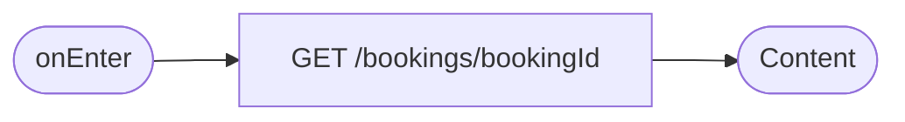
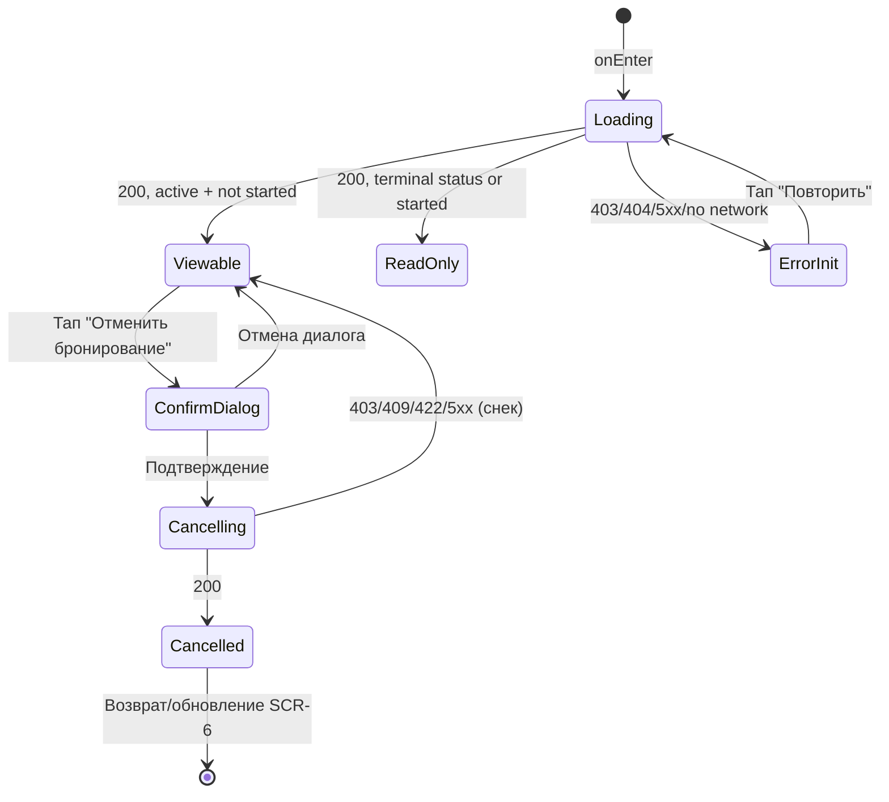

# Детали бронирования и отмена

**ID:** SCR-7
**Тип:** Экран
**Домен:** 02. Бронирование
**Приоритет:** Critical
**Статус:** На согласовании
**Функциональные блоки:** FB-BOOKING-CANCEL
**Зона авторизации:** АЗ
**Дизайн-макет:** не приложен — требуется разработка в Figma

---

## Содержание

- [История изменений](#история-изменений)
- [Обзор](#обзор)
- [Навигация](#навигация)
- [Входные данные](#входные-данные)
- [Применяемые логики](#применяемые-логики)
- [Инициализация](#инициализация)
- [Используемые запросы](#используемые-запросы)
- [Макет экрана](#макет-экрана)
- [Элементы экрана](#элементы-экрана)
- [Состояния экрана](#состояния-экрана)
- [Действия пользователя](#действия-пользователя)
- [Связанные требования](#связанные-требования)
- [Критерии приёмки](#критерии-приёмки)

---

## История изменений

| Релиз | ТЗ | Описание изменений |
|-------|-----|-------------------|
| 0.1.0 | 07-booking-details-cancel.md | Первоначальная документация |

---

## Обзор

Экран полной информации о конкретной брони с возможностью её отмены.
Реализует основную логику политики отмены (бесплатно за 2 часа / поздняя
отмена без штрафа) и является единственным местом в приложении, где клиент
может инициировать отмену брони.

### User Story

> Как клиент, я хочу видеть полную информацию о своей брони и иметь
> возможность отменить её, понимая заранее, будет ли отмена бесплатной.

### Бизнес-ценность

- Самостоятельная отмена клиентом снижает нагрузку на персонал скалодрома.
- Прозрачные условия отмены (без штрафа при поздней отмене) снижают тревожность
  и повышают долю самостоятельных отмен (метрика M-3).

---

## Навигация

### Входящая (откуда открывается)

| Источник | Триггер | Условие | Передаваемые параметры |
|----------|---------|---------|------------------------|
| [SCR-6 Мои бронирования](./SCR-6_my-bookings.md) | Тап по карточке брони | Всегда | `bookingId` |
| Push-уведомление ([SCR-8](./SCR-8_cancellation-notification.md)) | Тап по уведомлению | `booking_id` определён в пейлоаде | `bookingId` |

### Исходящая (куда ведёт)

| Назначение | Триггер | Передаваемые параметры |
|------------|---------|------------------------|
| [SCR-6 Мои бронирования](./SCR-6_my-bookings.md) | Успешная отмена / кнопка «Назад» | — (список должен обновиться) |

---

## Входные данные

| Название | Тип | Возможные значения | Описание |
|----------|-----|-------------------|----------|
| `bookingId` | Параметр навигации | UUID | ID брони для запроса деталей |

---

## Применяемые логики

| Логика | Элемент/Триггер | Описание |
|--------|-----------------|----------|
| [LOGIC-001 Статусы и бейджи брони](../logics/LOGIC-001_status-broni.md) | Бейдж статуса в шапке | Единое отображение статуса |
| [LOGIC-002 Политика отмены](../logics/LOGIC-002_politika-otmeny.md) | Кнопка «Отменить бронирование», диалог подтверждения | Полный флоу проверки и выполнения отмены |

---

## Инициализация

### Диаграмма загрузки



### Запросы при открытии

| № | Запрос | Критичный | Зависит от | Условие |
|---|--------|-----------|------------|---------|
| 1 | [GET /bookings/{bookingId}](#get-bookingsbookingid) | Да | — | Всегда |

---

## Используемые запросы

### GET /bookings/{bookingId}

**Тип:** REST
**Метод:** GET
**Спецификация:** `openapi.yaml` → `operationId: getBooking`

**Триггер:** Инициализация экрана

**Параметры:**

| Параметр | Тип | Обязательность | Источник | Описание |
|----------|-----|-----------------|----------|----------|
| `bookingId` | string (uuid) | Да | Параметр навигации | ID брони |

**Обработка ответа:**

| Результат | Условие | UI-реакция |
|-----------|---------|------------|
| Загрузка | — | Skeleton блоков |
| Успех | `status = active`, тренировка ещё не началась | Полный контент, кнопка «Отменить бронирование» активна |
| Успех | `status = active`, тренировка уже началась/завершилась | Контент, кнопка отмены скрыта |
| Успех | `status ∈ {cancelled, late_cancel, club_cancelled}` | Контент только для просмотра, кнопка отмены скрыта |
| HTTP 403 | Бронь принадлежит другому клиенту | Error state «Нет доступа» (в норме не должно происходить, NFR-9) |
| HTTP 404 | Бронь не найдена | Error state «Бронь не найдена» с возвратом на SCR-6 |
| HTTP 401 | — | Переход на экран авторизации |
| HTTP 5xx / сеть | — | Error state с кнопкой «Повторить» |

> Полное описание запроса отмены (`POST /bookings/{bookingId}/cancel`) —
> см. [LOGIC-002 Политика отмены](../logics/LOGIC-002_politika-otmeny.md#post-bookingsbookingidcancel).

---

## Макет экрана

### Структура

```
┌─────────────────────────────────────┐
│ [←] Детали бронирования             │  ← Header + бейдж статуса
├─────────────────────────────────────┤
│ Тренировка: дата, время, инструктор │
│ Стоимость, участники, оборудование  │
│ Статус оплаты                       │
│ Осталось до начала: {X ч Y мин}     │
│ Политика отмены (справка)           │
├─────────────────────────────────────┤
│      [Отменить бронирование]        │  ← Fixed bottom (условно видимая)
└─────────────────────────────────────┘
```

### Компоненты

| Компонент | Описание | Обязательность |
|-----------|----------|-----------------|
| Шапка со статусом | Бейдж статуса брони | Да |
| Блок деталей | Тренировка, стоимость, участники, оборудование, оплата | Да |
| Индикатор времени до начала | Влияет на тип отмены | Да |
| Кнопка «Отменить бронирование» | Условно видимая | Да |
| Диалог подтверждения отмены | Модальное окно | Да |

---

## Элементы экрана

### 1. Детали брони

| Элемент | Описание | Источник данных | Валидация | Действие |
|---------|----------|-----------------|-----------|----------|
| Бейдж статуса | | `booking.status` через [LOGIC-001](../logics/LOGIC-001_status-broni.md) | — | — |
| Тренировка | Дата, время, инструктор | `booking.training.*` | — | — |
| Стоимость | | `booking.training.price` | — | — |
| Количество участников | | `booking.participants_count` | — | — |
| Оборудование | | `booking.equipment_type` | — | — |
| Статус оплаты | Только отображение (BR-13) | `booking.payment_status` | — | — |
| Время до начала | Обратный отсчёт/статичный текст | `booking.training.start_at` − текущее время | — | — |
| Политика отмены | Справочный текст | Статично | — | — |

### 2. Действие отмены

| Элемент | Описание | Источник данных | Валидация | Действие |
|---------|----------|-----------------|-----------|----------|
| Кнопка «Отменить бронирование» | Fixed bottom | — | — | Открыть диалог подтверждения |
| Диалог подтверждения | С указанием типа отмены (бесплатно/поздняя) | Вычисляется через [LOGIC-002](../logics/LOGIC-002_politika-otmeny.md) | — | Подтвердить → `POST /bookings/{bookingId}/cancel`; Отмена → закрыть диалог |

**Логика:**
- Полный флоу кнопки и диалога: [LOGIC-002 Политика отмены](../logics/LOGIC-002_politika-otmeny.md).

**Условия доступности:**
- Кнопка «Отменить бронирование» видима и активна, если: `booking.status = active` И тренировка ещё не началась (`now < booking.training.start_at`).
- Кнопка скрыта при `status ∈ {cancelled, late_cancel, club_cancelled}` или если тренировка уже началась/завершилась.

---

## Состояния экрана

### Таблица состояний

| Состояние | Условие | Отображение |
|-----------|---------|-------------|
| Loading | Ожидание `GET /bookings/{bookingId}` | Skeleton |
| Просмотр — можно отменить | `active`, тренировка не началась | Полный контент + активная кнопка отмены |
| Просмотр — только просмотр | `active` и тренировка началась/прошла, либо статус терминальный | Контент без кнопки отмены |
| Подтверждение отмены | Открыт диалог | Модальное окно с указанием типа отмены |
| Отправка отмены | После подтверждения | Лоадер, отклик ≤ 3 сек (NFR-2) |
| Успех отмены | 200 | Обновлённый статус, бейдж и текст изменены, кнопка отмены скрывается |
| Ошибка отмены | 403/404/409/422/5xx | Сообщение об ошибке, возможность повтора (кроме 422 — тренировка уже началась) |
| Error инициализации | 403/404/5xx/нет сети | Error state с кнопкой «Повторить»/возврата |

### Диаграмма переходов



---

## Действия пользователя

| Действие | Элемент | Триггер | Результат |
|----------|---------|---------|-----------|
| Отменить бронирование | Кнопка «Отменить бронирование» | Tap | Открытие диалога подтверждения |
| Подтвердить отмену | Кнопка в диалоге | Tap | `POST /bookings/{bookingId}/cancel` |
| Отказаться от отмены | Кнопка «Не отменять»/крестик в диалоге | Tap | Закрытие диалога без изменений |
| Вернуться к списку | Системная кнопка «Назад» | Tap/Swipe | Возврат на [SCR-6](./SCR-6_my-bookings.md) с обновлёнными данными |

---

## Связанные требования

### Функциональные

| ID | Название | Приоритет |
|----|----------|-----------|
| FR-13 | Возможность отмены брони клиентом | Critical |
| FR-14 | Немедленное освобождение места при ранней отмене | Critical |
| FR-15 | Фиксация поздней отмены | Critical |
| FR-16 | Отсутствие штрафа за позднюю отмену | Critical |

### Данные

| ID | Название | Приоритет |
|----|----------|-----------|
| BR-5 | Возможность отмены — базовая функция | Critical |
| NFR-2 | Отклик отмены ≤ 3 сек | High |
| NFR-5 | Немедленное освобождение места | High |
| NFR-9 | Доступ только к собственной брони | Critical |

---

## Критерии приёмки

### Позитивные сценарии

| ID | Критерий | Приоритет |
|----|----------|-----------|
| AC-001 | **Дано** бронь активна, до тренировки ≥ 2 часов, **Когда** клиент подтверждает отмену, **Тогда** статус меняется на «Отменена клиентом», место освобождается | P0 |
| AC-002 | **Дано** бронь активна, до тренировки < 2 часов, **Когда** клиент подтверждает отмену, **Тогда** статус меняется на «Поздняя отмена», штраф не отображается | P0 |

### Негативные сценарии

| ID | Критерий | Приоритет |
|----|----------|-----------|
| AC-N01 | **Дано** тренировка уже началась, **Когда** клиент открывает SCR-7, **Тогда** кнопка «Отменить бронирование» скрыта | P0 |
| AC-N02 | **Дано** бронь уже отменена скалодромом, **Когда** клиент открывает SCR-7, **Тогда** кнопка «Отменить бронирование» скрыта | P0 |
| AC-N03 | **Дано** повторная попытка отмены уже отменённой брони (race condition), **Когда** сервер возвращает 409, **Тогда** статус на экране обновляется, показывается понятное сообщение | P1 |

### Граничные условия

| ID | Критерий | Приоритет |
|----|----------|-----------|
| AC-E01 | **Дано** клиент открыл диалог подтверждения ровно на границе 2 часов, **Когда** время пересекает границу до нажатия «Подтвердить», **Тогда** финальный тип отмены определяется сервером на момент запроса, а не локальным расчётом | P1 |

---
