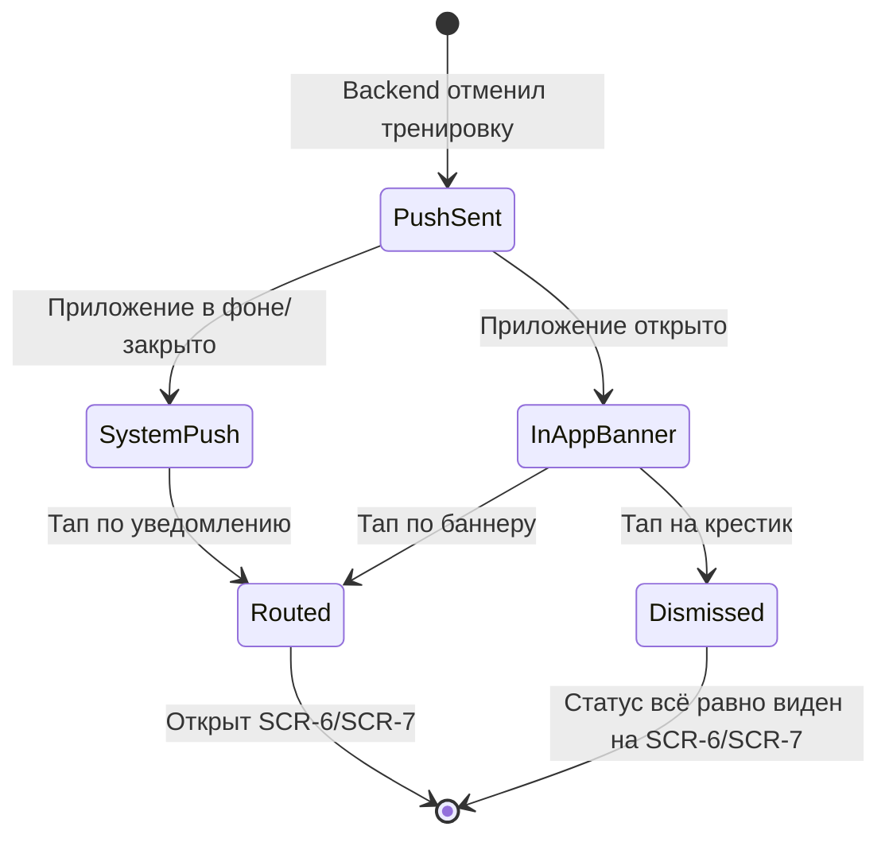

# Уведомление об отмене тренировки

**ID:** SCR-8
**Тип:** Экран (push-уведомление + связанные экраны статуса)
**Домен:** 02. Бронирование
**Приоритет:** Critical
**Статус:** На согласовании
**Функциональные блоки:** FB-CLUB-CANCEL-NOTIFICATION
**Зона авторизации:** АЗ
**Дизайн-макет:** не приложен — требуется разработка в Figma

---

## Содержание

- [История изменений](#история-изменений)
- [Обзор](#обзор)
- [Навигация](#навигация)
- [Входные данные](#входные-данные)
- [Применяемые логики](#применяемые-логики)
- [Макет экрана](#макет-экрана)
- [Элементы экрана](#элементы-экрана)
- [Состояния экрана](#состояния-экрана)
- [Действия пользователя](#действия-пользователя)
- [Связанные требования](#связанные-требования)
- [Критерии приёмки](#критерии-приёмки)

---

## История изменений

| Релиз | ТЗ | Описание изменений |
|-------|-----|-------------------|
| 0.1.0 | 08-cancellation-notification.md | Первоначальная документация |
| 0.1.1 | Решение по открытому вопросу №7 (см. `00-OPEN-QUESTIONS-LOG.md`) | Подтверждено: отдельный журнал/раздел «Уведомления» в MVP не реализуется |

---

## Обзор

Не является отдельным полноценным «экраном» в традиционном смысле — это
связка из (1) системного/in-app push-уведомления и (2) обновлённого статуса
брони, видимого на [SCR-6](./SCR-6_my-bookings.md) и [SCR-7](./SCR-7_booking-details-cancel.md).
Инициатор — административная система скалодрома (вне скоупа клиентского
приложения, NFR-14); клиентское приложение только принимает и маршрутизирует
уведомление.

### User Story

> Как клиент, я хочу сразу узнать, если скалодром отменил мою тренировку, и
> видеть актуальный статус брони независимо от того, увидел ли я
> уведомление.

### Бизнес-ценность

- Снижает число клиентов, приходящих на отменённую тренировку впустую.
- Формирует доверие к приложению как надёжному источнику информации о
  статусе записи.

---

## Навигация

### Входящая (откуда открывается)

| Источник | Триггер | Условие | Передаваемые параметры |
|----------|---------|---------|------------------------|
| Push-провайдер (backend-событие) | Административная отмена тренировки | `training.status → cancelled` | `type = training_cancelled`, `booking_id` (может отсутствовать) |

### Исходящая (куда ведёт)

| Назначение | Триггер | Передаваемые параметры |
|------------|---------|------------------------|
| [SCR-7 Детали бронирования](./SCR-7_booking-details-cancel.md) | Тап по уведомлению, `booking_id` известен | `bookingId` |
| [SCR-6 Мои бронирования](./SCR-6_my-bookings.md) | Тап по уведомлению, `booking_id` не определён | — |

---

## Входные данные

| Название | Тип | Возможные значения | Описание |
|----------|-----|-------------------|----------|
| `push.type` | Payload push | `training_cancelled` | Тип события |
| `push.booking_id` | Payload push | UUID, nullable | Целевая бронь для маршрутизации |
| Состояние приложения | ОС | `foreground`/`background`/`killed` | Определяет форму показа уведомления |

---

## Применяемые логики

| Логика | Элемент/Триггер | Описание |
|--------|-----------------|----------|
| [LOGIC-003 Push-уведомление и маршрутизация](../logics/LOGIC-003_push-otmena-trenirovki.md) | Получение push, тап по уведомлению | Полный флоу получения, отображения и маршрутизации |
| [LOGIC-001 Статусы и бейджи брони](../logics/LOGIC-001_status-broni.md) | Обновлённый статус на SCR-6/SCR-7 | Отображение «Отменена скалодромом» |

---

## Макет экрана

### Структура

```
Системное push-уведомление (ОС):
┌─────────────────────────────────────┐
│ 🔔 Вертикаль                        │
│ Тренировка {дата, время} отменена   │
└─────────────────────────────────────┘

In-app плашка (если приложение открыто):
┌─────────────────────────────────────┐
│ ⚠ Тренировка {дата, время} отменена │
│   администрацией скалодрома      [✕]│
└─────────────────────────────────────┘
```

### Компоненты

| Компонент | Описание | Обязательность |
|-----------|----------|-----------------|
| Системное push-уведомление | Стандартный компонент ОС | Да |
| In-app плашка (баннер) | Показ при открытом приложении, конкретный визуальный механизм на усмотрение дизайна | Да (открытый вопрос по деталям реализации) |
| Обновлённый бейдж статуса на SCR-6/SCR-7 | «Отменена скалодромом» | Да |

---

## Элементы экрана

### 1. Push-уведомление

| Элемент | Описание | Источник данных | Валидация | Действие |
|---------|----------|-----------------|-----------|----------|
| Текст уведомления | Краткое сообщение с датой/временем отменённой тренировки | Пейлоад push | — | Тап → маршрутизация через [LOGIC-003](../logics/LOGIC-003_push-otmena-trenirovki.md) |

### 2. In-app плашка

| Элемент | Описание | Источник данных | Валидация | Действие |
|---------|----------|-----------------|-----------|----------|
| Баннер отмены | Показывается поверх текущего экрана, если приложение открыто в момент события | Пейлоад push | — | Тап → маршрутизация; крестик → скрыть баннер без перехода |

### 3. Статус на SCR-6 / SCR-7

| Элемент | Описание | Источник данных | Валидация | Действие |
|---------|----------|-----------------|-----------|----------|
| Бейдж «Отменена скалодромом» | Красный бейдж | `booking.status = club_cancelled` через [LOGIC-001](../logics/LOGIC-001_status-broni.md) | — | — |
| Кнопка «Отменить бронирование» на SCR-7 | Скрыта для этого статуса | — | — | — |

---

## Состояния экрана

### Таблица состояний

| Состояние | Условие | Отображение |
|-----------|---------|-------------|
| Уведомление получено, приложение закрыто | `background`/`killed` | Стандартное системное push |
| Уведомление получено, приложение открыто | `foreground` | In-app баннер (механизм на усмотрение дизайна) |
| Просмотр статуса без уведомления | Push не дошёл/не открыт | Актуальный статус виден на SCR-6/SCR-7 в любой момент (NFR-6) |

### Диаграмма переходов



---

## Действия пользователя

| Действие | Элемент | Триггер | Результат |
|----------|---------|---------|-----------|
| Открыть уведомление | Push / in-app баннер | Tap | Переход на SCR-7 (если `booking_id` известен) или SCR-6 |
| Скрыть in-app баннер | Крестик на баннере | Tap | Баннер скрывается, приложение остаётся на текущем экране |
| Проверить статус без уведомления | Раздел «Мои бронирования» | Обычный заход | Статус «Отменена скалодромом» виден как обычно |

---

## Связанные требования

### Функциональные

| ID | Название | Приоритет |
|----|----------|-----------|
| FR-17 | Автоматическая push-рассылка при отмене тренировки скалодромом | Critical |
| FR-18 | Обновление статуса брони | Critical |
| FR-19 | Блокировка повторной записи и действий с отменённой тренировкой/бронью | Critical |

### Данные

| ID | Название | Приоритет |
|----|----------|-----------|
| BR-8 | Push — единственный канал уведомлений в MVP | High |
| NFR-6 | Backend — единственный источник истины | Critical |

---

## Критерии приёмки

### Позитивные сценарии

| ID | Критерий | Приоритет |
|----|----------|-----------|
| AC-001 | **Дано** тренировка отменена и у клиента активная бронь, **Когда** событие происходит, **Тогда** клиент получает push-уведомление | P0 |
| AC-002 | **Дано** push содержит `booking_id`, **Когда** клиент тапает по уведомлению, **Тогда** открывается SCR-7 с деталями соответствующей брони | P0 |

### Негативные сценарии

| ID | Критерий | Приоритет |
|----|----------|-----------|
| AC-N01 | **Дано** push не был доставлен, **Когда** клиент самостоятельно заходит на SCR-6, **Тогда** статус «Отменена скалодромом» всё равно отображается | P0 |
| AC-N02 | **Дано** push не содержит `booking_id`, **Когда** клиент тапает по уведомлению, **Тогда** открывается SCR-6, а не ошибка | P1 |

### Граничные условия

| ID | Критерий | Приоритет |
|----|----------|-----------|
| AC-E01 | **Дано** приложение открыто в момент события, **Когда** показан in-app баннер, **Тогда** пользователь может скрыть его без потери доступа к статусу через SCR-6/SCR-7 | P2 |

---
