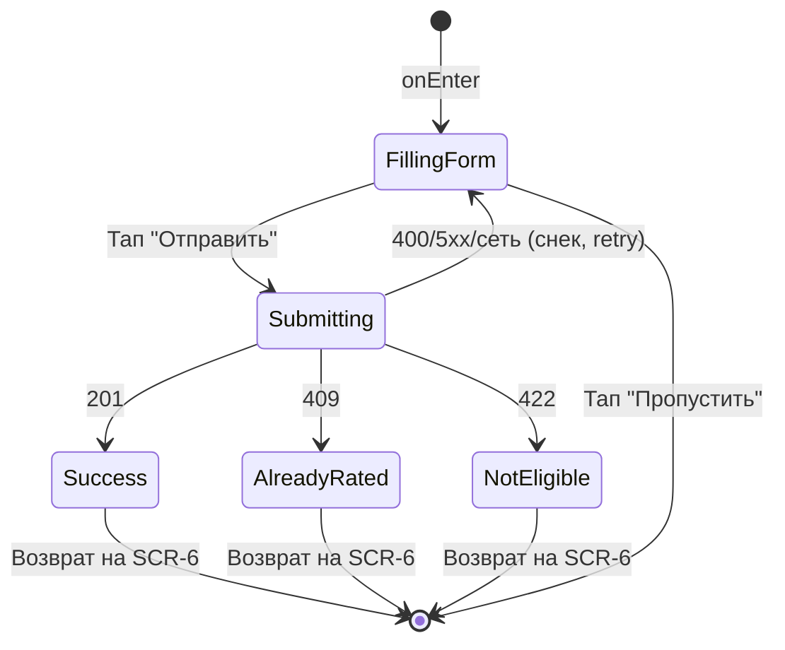

# Оценка инструктора

**ID:** SCR-9
**Тип:** Экран
**Домен:** 03. Оценки
**Приоритет:** Medium (Should)
**Статус:** На согласовании
**Функциональные блоки:** FB-INSTRUCTOR-RATING
**Зона авторизации:** АЗ
**Дизайн-макет:** не приложен — требуется разработка в Figma

---

## Содержание

- [История изменений](#история-изменений)
- [Обзор](#обзор)
- [Навигация](#навигация)
- [Входные данные](#входные-данные)
- [Применяемые логики](#применяемые-логики)
- [Используемые запросы](#используемые-запросы)
- [Макет экрана](#макет-экрана)
- [Элементы экрана](#элементы-экрана)
- [Состояния экрана](#состояния-экрана)
- [Действия пользователя](#действия-пользователя)
- [Связанные требования](#связанные-требования)
- [Критерии приёмки](#критерии-приёмки)

---

## История изменений

| Релиз | ТЗ | Описание изменений |
|-------|-----|-------------------|
| 0.1.0 | 09-instructor-rating.md | Первоначальная документация |
| 0.1.1 | Решение по открытому вопросу №6 (см. `00-OPEN-QUESTIONS-LOG.md`) | Подтверждено: редактирование ранее оставленной оценки не входит в MVP (см. [LOGIC-005](../logics/LOGIC-005_dostupnost-ocenki.md)) |

---

## Обзор

Экран оценки инструктора по завершённой тренировке. Should-приоритет —
реализуется при наличии времени в рамках MVP. Оценка доступна только один
раз на бронь и только после того, как тренировка завершилась.

### User Story

> Как клиент, я хочу оценить инструктора и оставить отзыв после завершения
> тренировки, чтобы поделиться впечатлением.

### Бизнес-ценность

- Сбор обратной связи об инструкторах для скалодрома (BR-10).
- Потенциальная основа для будущего отображения рейтинга инструктора на
  SCR-1/SCR-3 (не входит в текущий скоуп, открытый вопрос).

---

## Навигация

### Входящая (откуда открывается)

| Источник | Триггер | Условие | Передаваемые параметры |
|----------|---------|---------|------------------------|
| [SCR-6 Мои бронирования](./SCR-6_my-bookings.md) | CTA «Оценить инструктора» | `booking.status = active`, тренировка завершена, `has_rating = false` | `bookingId` |

### Исходящая (куда ведёт)

| Назначение | Триггер | Передаваемые параметры |
|------------|---------|------------------------|
| [SCR-6 Мои бронирования](./SCR-6_my-bookings.md) | Успешная отправка оценки / кнопка «Пропустить» / «Назад» | — |

---

## Входные данные

| Название | Тип | Возможные значения | Описание |
|----------|-----|-------------------|----------|
| `bookingId` | Параметр навигации | UUID | Бронь, по которой оценивается инструктор |
| Контекст тренировки/инструктора | Состояние, переданное с SCR-6 | Имя инструктора, дата тренировки | Для отображения контекста без дополнительного запроса (данные уже присутствуют в объекте `Booking`, полученном на SCR-6) |

---

## Применяемые логики

| Логика | Элемент/Триггер | Описание |
|--------|-----------------|----------|
| [LOGIC-005 Доступность оценки инструктора](../logics/LOGIC-005_dostupnost-ocenki.md) | Открытие экрана, отправка оценки | Полный флоу проверки доступности и отправки |

---

## Используемые запросы

### POST /bookings/{bookingId}/rating

**Тип:** REST
**Метод:** POST
**Спецификация:** `openapi.yaml` → `operationId: createRating`

**Триггер:** Кнопка «Отправить» на форме оценки

**Параметры (Body):**

| Параметр | Тип | Обязательность | Источник | Описание |
|----------|-----|-----------------|----------|----------|
| `score` | integer (1–5) | Да | Выбор пользователя (звёзды) | FR-20 |
| `comment` | string, ≤ 2000 симв. | Нет | Ввод пользователя | FR-21 |

**Обработка ответа:**

| Результат | Условие | UI-реакция |
|-----------|---------|------------|
| Загрузка | — | Лоадер на кнопке «Отправить» |
| Успех 201 | Оценка сохранена | Экран успеха → авто-возврат на SCR-6 (CTA скрыт) |
| 400 | Невалидные данные (напр. пустой `score`) | Снек с текстом из `message` |
| 409 | Оценка по этой брони уже существует | Снек с сообщением, возврат на SCR-6 |
| 422 | Тренировка ещё не завершена / бронь не `active` | Снек с сообщением, возврат на SCR-6 |
| 401/403 | — | Переход на авторизацию / снек «Нет доступа» |
| 5xx / сеть | — | Снек «Произошла ошибка. Попробуйте позже» / «Нет соединения...» |

---

## Макет экрана

### Структура

```
┌─────────────────────────────────────┐
│ [←] Оценить инструктора             │  ← Header
├─────────────────────────────────────┤
│ Тренировка: дата, инструктор (фото) │  ← Read-only контекст
├─────────────────────────────────────┤
│      ★ ★ ★ ★ ★  (выбор 1–5)         │
│ ┌───────────────────────────────┐  │
│ │ Текстовый отзыв (опционально) │  │
│ └───────────────────────────────┘  │
├─────────────────────────────────────┤
│   [Пропустить]      [Отправить]     │  ← Fixed bottom
└─────────────────────────────────────┘
```

### Компоненты

| Компонент | Описание | Обязательность |
|-----------|----------|-----------------|
| Контекстный блок | Тренировка + инструктор | Да |
| Селектор оценки (звёзды 1–5) | | Да |
| Поле текстового отзыва | Опциональное, до 2000 символов | Да |
| Кнопки «Пропустить» / «Отправить» | | Да |

---

## Элементы экрана

### 1. Контекст

| Элемент | Описание | Источник данных | Валидация | Действие |
|---------|----------|-----------------|-----------|----------|
| Тренировка и инструктор | Дата, имя, фото | `booking.training.start_at`, `booking.training.instructor.*` | — | — |

### 2. Форма оценки

| Элемент | Описание | Источник данных | Валидация | Действие |
|---------|----------|-----------------|-----------|----------|
| Селектор «Оценка» | 5 звёзд, тап на N-ю звезду выбирает оценку N | Локальное состояние `score` | Обязательное поле. Ошибка: «Выберите оценку от 1 до 5» | Обновляет `score` |
| Поле «Отзыв» | Многострочный текст | Локальное состояние `comment` | Опционально, ≤ 2000 символов. Ошибка: «Отзыв не может быть длиннее 2000 символов» | Обновляет `comment` |
| Кнопка «Отправить» | Primary | — | — | Валидация → [POST /bookings/{bookingId}/rating](#post-bookingsbookingidrating) |
| Кнопка «Пропустить» | Secondary | — | — | Закрыть экран без отправки, возврат на SCR-6 |

**Момент валидации:** При отправке формы.

**Логика:**
- Кнопка «Отправить»: [LOGIC-005](../logics/LOGIC-005_dostupnost-ocenki.md).

**Условия доступности:**
- Кнопка «Отправить» активна, если `score` задан (1–5); поле отзыва не влияет на активность кнопки.

---

## Состояния экрана

### Таблица состояний

| Состояние | Условие | Отображение |
|-----------|---------|-------------|
| Заполнение | Экран открыт | Интерактивная форма оценки |
| Отправка | После нажатия «Отправить» | Лоадер на кнопке |
| Успех | 201 | Сообщение «Спасибо за оценку», авто-возврат на SCR-6 |
| Ошибка — уже оценено | 409 | Сообщение + возврат на SCR-6 |
| Ошибка — недоступно | 422 | Сообщение «Оценка пока недоступна» + возврат на SCR-6 |
| Ошибка сети/сервера | 5xx / нет сети | Снек с сообщением, форма сохраняется, доступен повтор |

### Диаграмма переходов



---

## Действия пользователя

| Действие | Элемент | Триггер | Результат |
|----------|---------|---------|-----------|
| Выбрать оценку | Звёзды 1–5 | Tap | Обновление `score` |
| Ввести отзыв | Текстовое поле | Ввод текста | Обновление `comment` |
| Отправить оценку | Кнопка «Отправить» | Tap | Валидация → `POST /bookings/{bookingId}/rating` |
| Пропустить оценку | Кнопка «Пропустить» | Tap | Возврат на [SCR-6](./SCR-6_my-bookings.md) без отправки |

---

## Связанные требования

### Функциональные

| ID | Название | Приоритет |
|----|----------|-----------|
| FR-20 | Оценка по пятибалльной шкале | Medium |
| FR-21 | Текстовый отзыв (опционально) | Medium |
| FR-22 | Доступность только после завершения тренировки | High |

### Данные

| ID | Название | Приоритет |
|----|----------|-----------|
| BR-10 | Оценка инструктора — Should-функция MVP | Medium |

---

## Критерии приёмки

### Позитивные сценарии

| ID | Критерий | Приоритет |
|----|----------|-----------|
| AC-001 | **Дано** тренировка завершена и оценка не оставлена, **Когда** клиент выбирает оценку и нажимает «Отправить», **Тогда** оценка сохраняется и клиент возвращается на SCR-6 | P1 |
| AC-002 | **Дано** клиент не хочет оценивать, **Когда** он нажимает «Пропустить», **Тогда** экран закрывается без отправки данных | P2 |

### Негативные сценарии

| ID | Критерий | Приоритет |
|----|----------|-----------|
| AC-N01 | **Дано** оценка не выбрана, **Когда** клиент нажимает «Отправить», **Тогда** отображается ошибка валидации и запрос не отправляется | P1 |
| AC-N02 | **Дано** оценка по этой брони уже существует (race condition), **Когда** сервер возвращает 409, **Тогда** клиент видит сообщение и возвращается на SCR-6 | P2 |
| AC-N03 | **Дано** тренировка ещё не завершилась (устаревшие локальные данные), **Когда** сервер возвращает 422, **Тогда** клиент видит понятное сообщение | P2 |

### Граничные условия

| ID | Критерий | Приоритет |
|----|----------|-----------|
| AC-E01 | **Дано** отзыв превышает 2000 символов, **Когда** клиент вводит текст, **Тогда** ввод ограничивается лимитом | P2 |

---
